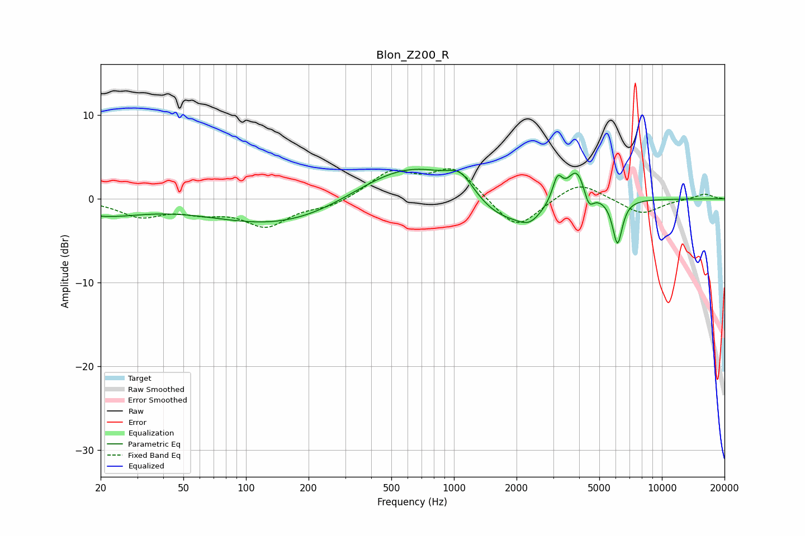

# Blon_Z200_R
See [usage instructions](https://github.com/jaakkopasanen/AutoEq#usage) for more options and info.

### Parametric EQs
Apply preamp of -3.6 dB when using parametric equalizer.

|   # | Type    |   Fc (Hz) |    Q |   Gain (dB) |
|-----|---------|-----------|------|-------------|
|   1 | Peaking |        20 | 0.75 |        -1.8 |
|   2 | Peaking |       167 | 0.4  |        -3.7 |
|   3 | Peaking |       622 | 0.48 |         5.4 |
|   4 | Peaking |      1081 | 2.31 |         2.2 |
|   5 | Peaking |      1659 | 0.83 |        -4.1 |
|   6 | Peaking |      2314 | 2.51 |        -1.5 |
|   7 | Peaking |      3145 | 6    |         2.8 |
|   8 | Peaking |      3901 | 3.04 |         4.1 |
|   9 | Peaking |      4446 | 5.95 |        -2.2 |
|  10 | Peaking |      6115 | 5.94 |        -5.4 |

### Fixed Band EQs
When using fixed band (also called graphic) equalizer, apply preamp of **-3.7 dB** (if available) and set gains manually with these parameters.

|   # | Type    |   Fc (Hz) |    Q |   Gain (dB) |
|-----|---------|-----------|------|-------------|
|   1 | Peaking |        31 | 1.41 |        -2   |
|   2 | Peaking |        62 | 1.41 |        -1.2 |
|   3 | Peaking |       125 | 1.41 |        -3.1 |
|   4 | Peaking |       250 | 1.41 |        -0.9 |
|   5 | Peaking |       500 | 1.41 |         3.1 |
|   6 | Peaking |      1000 | 1.41 |         3.6 |
|   7 | Peaking |      2000 | 1.41 |        -3.9 |
|   8 | Peaking |      4000 | 1.41 |         2.2 |
|   9 | Peaking |      8000 | 1.41 |        -1.9 |
|  10 | Peaking |     16000 | 1.41 |         0.6 |

### Graphs

