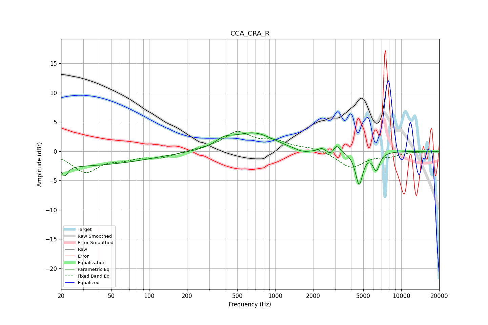

# CCA_CRA_R
See [usage instructions](https://github.com/jaakkopasanen/AutoEq#usage) for more options and info.

### Parametric EQs
Apply preamp of -3.2 dB when using parametric equalizer.

|   # | Type    |   Fc (Hz) |    Q |   Gain (dB) |
|-----|---------|-----------|------|-------------|
|   1 | Peaking |        21 | 5.92 |        -1.7 |
|   2 | Peaking |        24 | 0.22 |        -2.5 |
|   3 | Peaking |       395 | 2.04 |         1.2 |
|   4 | Peaking |       675 | 0.89 |         3   |
|   5 | Peaking |      1654 | 2.06 |        -0.7 |
|   6 | Peaking |      2339 | 6    |         0.5 |
|   7 | Peaking |      2749 | 6    |        -0.7 |
|   8 | Peaking |      3075 | 5.99 |         1.2 |
|   9 | Peaking |      4634 | 4.9  |        -5.6 |
|  10 | Peaking |      6340 | 5.33 |        -3   |

### Fixed Band EQs
When using fixed band (also called graphic) equalizer, apply preamp of **-3.5 dB** (if available) and set gains manually with these parameters.

|   # | Type    |   Fc (Hz) |    Q |   Gain (dB) |
|-----|---------|-----------|------|-------------|
|   1 | Peaking |        31 | 1.41 |        -3.4 |
|   2 | Peaking |        62 | 1.41 |        -1   |
|   3 | Peaking |       125 | 1.41 |        -1   |
|   4 | Peaking |       250 | 1.41 |         0.2 |
|   5 | Peaking |       500 | 1.41 |         3.1 |
|   6 | Peaking |      1000 | 1.41 |         1.5 |
|   7 | Peaking |      2000 | 1.41 |         0.6 |
|   8 | Peaking |      4000 | 1.41 |        -2.8 |
|   9 | Peaking |      8000 | 1.41 |        -0.7 |
|  10 | Peaking |     16000 | 1.41 |        -0.1 |

### Graphs

