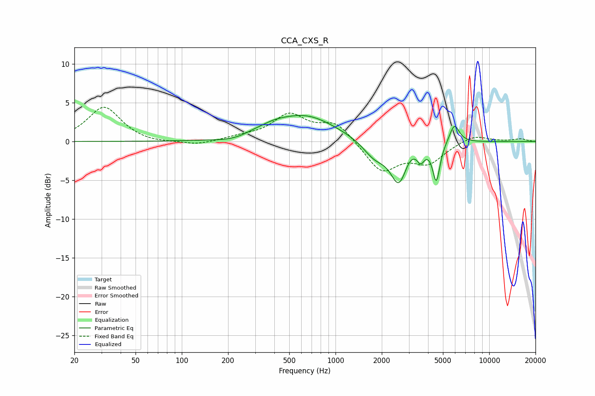

# CCA_CXS_R
See [usage instructions](https://github.com/jaakkopasanen/AutoEq#usage) for more options and info.

### Parametric EQs
Apply preamp of -3.4 dB when using parametric equalizer.

|   # | Type    |   Fc (Hz) |    Q |   Gain (dB) |
|-----|---------|-----------|------|-------------|
|   1 | Peaking |       216 | 1.29 |        -0.5 |
|   2 | Peaking |       297 | 2.02 |         0.2 |
|   3 | Peaking |       398 | 1.63 |         0.6 |
|   4 | Peaking |       636 | 0.71 |         3.3 |
|   5 | Peaking |      1796 | 1.83 |        -2.1 |
|   6 | Peaking |      2589 | 2.56 |        -5.3 |
|   7 | Peaking |      3021 | 3.11 |         0.9 |
|   8 | Peaking |      3587 | 6    |        -1.6 |
|   9 | Peaking |      4527 | 5.99 |        -4.8 |
|  10 | Peaking |      5930 | 4.27 |         2.5 |

### Fixed Band EQs
When using fixed band (also called graphic) equalizer, apply preamp of **-4.5 dB** (if available) and set gains manually with these parameters.

|   # | Type    |   Fc (Hz) |    Q |   Gain (dB) |
|-----|---------|-----------|------|-------------|
|   1 | Peaking |        31 | 1.41 |         4.5 |
|   2 | Peaking |        62 | 1.41 |        -0.3 |
|   3 | Peaking |       125 | 1.41 |        -0.5 |
|   4 | Peaking |       250 | 1.41 |         0.5 |
|   5 | Peaking |       500 | 1.41 |         3.3 |
|   6 | Peaking |      1000 | 1.41 |         2.4 |
|   7 | Peaking |      2000 | 1.41 |        -3.9 |
|   8 | Peaking |      4000 | 1.41 |        -2.6 |
|   9 | Peaking |      8000 | 1.41 |         0.9 |
|  10 | Peaking |     16000 | 1.41 |         0.3 |

### Graphs

