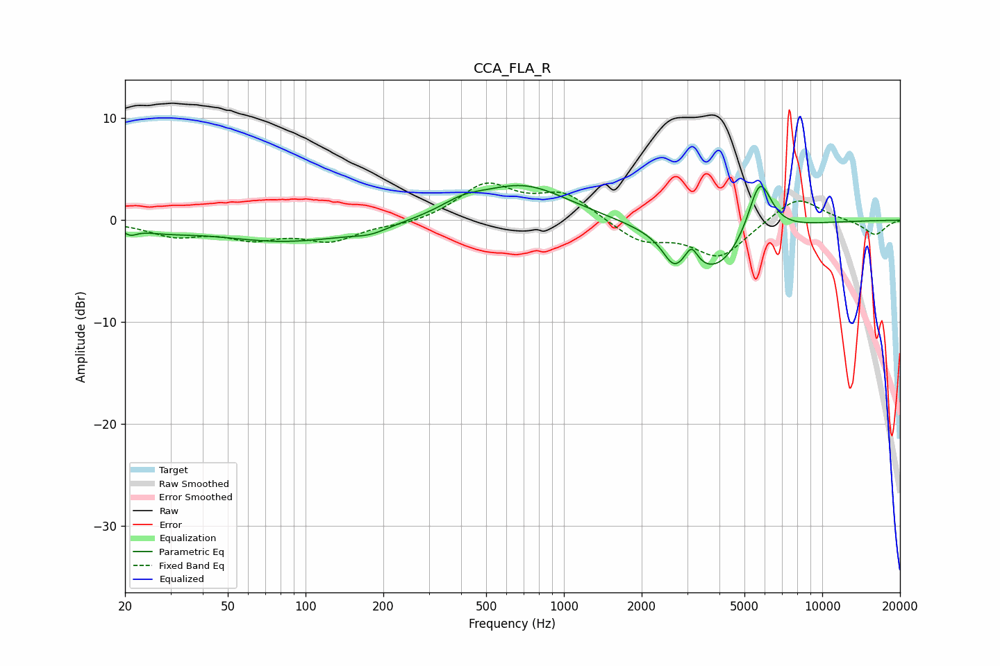

# CCA_FLA_R
See [usage instructions](https://github.com/jaakkopasanen/AutoEq#usage) for more options and info.

### Parametric EQs
Apply preamp of -3.5 dB when using parametric equalizer.

|   # | Type    |   Fc (Hz) |    Q |   Gain (dB) |
|-----|---------|-----------|------|-------------|
|   1 | Peaking |        21 | 5.52 |        -0.6 |
|   2 | Peaking |        28 | 1.24 |        -0.6 |
|   3 | Peaking |        86 | 0.5  |        -2.1 |
|   4 | Peaking |       178 | 2.12 |        -0.6 |
|   5 | Peaking |       405 | 1.68 |         1   |
|   6 | Peaking |       696 | 0.8  |         3.5 |
|   7 | Peaking |      2655 | 3.56 |        -2   |
|   8 | Peaking |      3119 | 6    |         1.7 |
|   9 | Peaking |      3801 | 1.06 |        -5.2 |
|  10 | Peaking |      5731 | 2.96 |         5.9 |

### Fixed Band EQs
When using fixed band (also called graphic) equalizer, apply preamp of **-3.7 dB** (if available) and set gains manually with these parameters.

|   # | Type    |   Fc (Hz) |    Q |   Gain (dB) |
|-----|---------|-----------|------|-------------|
|   1 | Peaking |        31 | 1.41 |        -1.4 |
|   2 | Peaking |        62 | 1.41 |        -1.5 |
|   3 | Peaking |       125 | 1.41 |        -1.9 |
|   4 | Peaking |       250 | 1.41 |        -0.4 |
|   5 | Peaking |       500 | 1.41 |         3.4 |
|   6 | Peaking |      1000 | 1.41 |         2.5 |
|   7 | Peaking |      2000 | 1.41 |        -2   |
|   8 | Peaking |      4000 | 1.41 |        -3.6 |
|   9 | Peaking |      8000 | 1.41 |         2.5 |
|  10 | Peaking |     16000 | 1.41 |        -1.5 |

### Graphs

