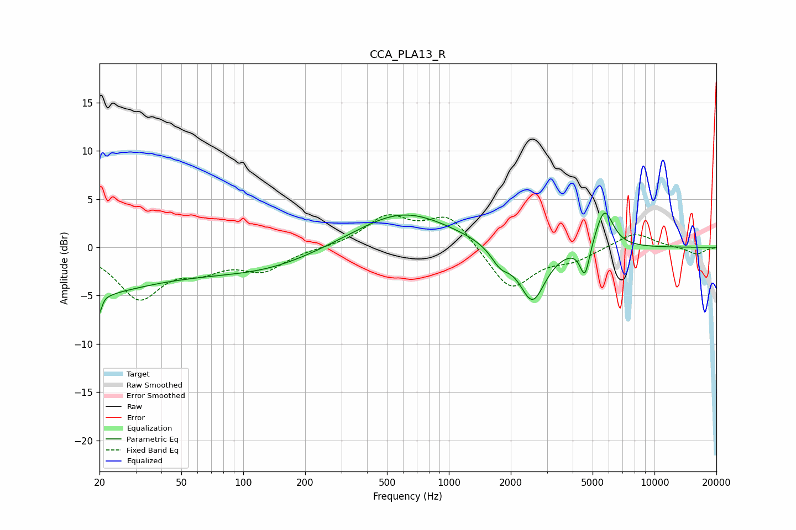

# CCA_PLA13_R
See [usage instructions](https://github.com/jaakkopasanen/AutoEq#usage) for more options and info.

### Parametric EQs
Apply preamp of -3.6 dB when using parametric equalizer.

|   # | Type    |   Fc (Hz) |    Q |   Gain (dB) |
|-----|---------|-----------|------|-------------|
|   1 | Peaking |        20 | 5.72 |        -5.3 |
|   2 | Peaking |        20 | 0.37 |        -4.5 |
|   3 | Peaking |        20 | 6    |         3.2 |
|   4 | Peaking |        37 | 0.96 |         0.3 |
|   5 | Peaking |       126 | 0.53 |        -2   |
|   6 | Peaking |       598 | 0.61 |         3.8 |
|   7 | Peaking |      1781 | 3.01 |        -1.7 |
|   8 | Peaking |      2548 | 2.22 |        -5.7 |
|   9 | Peaking |      4589 | 5.99 |        -3.4 |
|  10 | Peaking |      5703 | 3.21 |         4.1 |

### Fixed Band EQs
When using fixed band (also called graphic) equalizer, apply preamp of **-3.5 dB** (if available) and set gains manually with these parameters.

|   # | Type    |   Fc (Hz) |    Q |   Gain (dB) |
|-----|---------|-----------|------|-------------|
|   1 | Peaking |        31 | 1.41 |        -5.1 |
|   2 | Peaking |        62 | 1.41 |        -1.8 |
|   3 | Peaking |       125 | 1.41 |        -2.2 |
|   4 | Peaking |       250 | 1.41 |        -0   |
|   5 | Peaking |       500 | 1.41 |         3   |
|   6 | Peaking |      1000 | 1.41 |         3.3 |
|   7 | Peaking |      2000 | 1.41 |        -4.5 |
|   8 | Peaking |      4000 | 1.41 |        -1.2 |
|   9 | Peaking |      8000 | 1.41 |         1.6 |
|  10 | Peaking |     16000 | 1.41 |        -0.7 |

### Graphs

