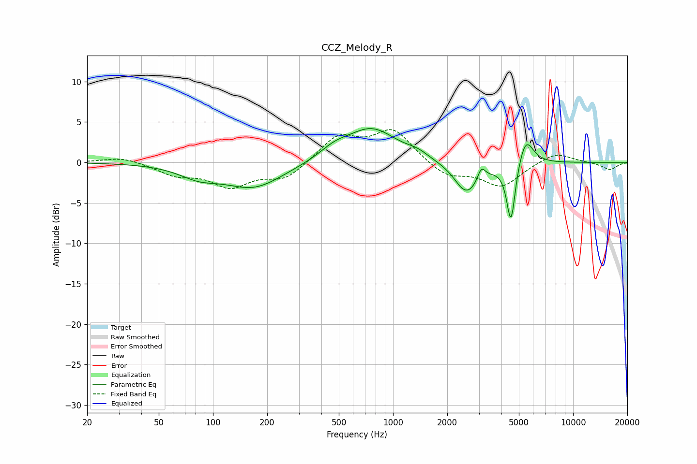

# CCZ_Melody_R
See [usage instructions](https://github.com/jaakkopasanen/AutoEq#usage) for more options and info.

### Parametric EQs
Apply preamp of -4.3 dB when using parametric equalizer.

|   # | Type    |   Fc (Hz) |    Q |   Gain (dB) |
|-----|---------|-----------|------|-------------|
|   1 | Peaking |        83 | 1.29 |        -1.4 |
|   2 | Peaking |       169 | 0.87 |        -3.1 |
|   3 | Peaking |       472 | 1.7  |         1.1 |
|   4 | Peaking |       760 | 1.01 |         4.1 |
|   5 | Peaking |      1364 | 2.4  |         0.6 |
|   6 | Peaking |      2438 | 3.12 |        -0.8 |
|   7 | Peaking |      2673 | 1.81 |        -3.4 |
|   8 | Peaking |      3093 | 6    |         1.9 |
|   9 | Peaking |      4518 | 5.87 |        -7.6 |
|  10 | Peaking |      5454 | 3.32 |         3.5 |

### Fixed Band EQs
When using fixed band (also called graphic) equalizer, apply preamp of **-4.1 dB** (if available) and set gains manually with these parameters.

|   # | Type    |   Fc (Hz) |    Q |   Gain (dB) |
|-----|---------|-----------|------|-------------|
|   1 | Peaking |        31 | 1.41 |         0.7 |
|   2 | Peaking |        62 | 1.41 |        -1.4 |
|   3 | Peaking |       125 | 1.41 |        -2.8 |
|   4 | Peaking |       250 | 1.41 |        -2   |
|   5 | Peaking |       500 | 1.41 |         3.2 |
|   6 | Peaking |      1000 | 1.41 |         3.9 |
|   7 | Peaking |      2000 | 1.41 |        -1.8 |
|   8 | Peaking |      4000 | 1.41 |        -2.9 |
|   9 | Peaking |      8000 | 1.41 |         1.3 |
|  10 | Peaking |     16000 | 1.41 |        -0.9 |

### Graphs

