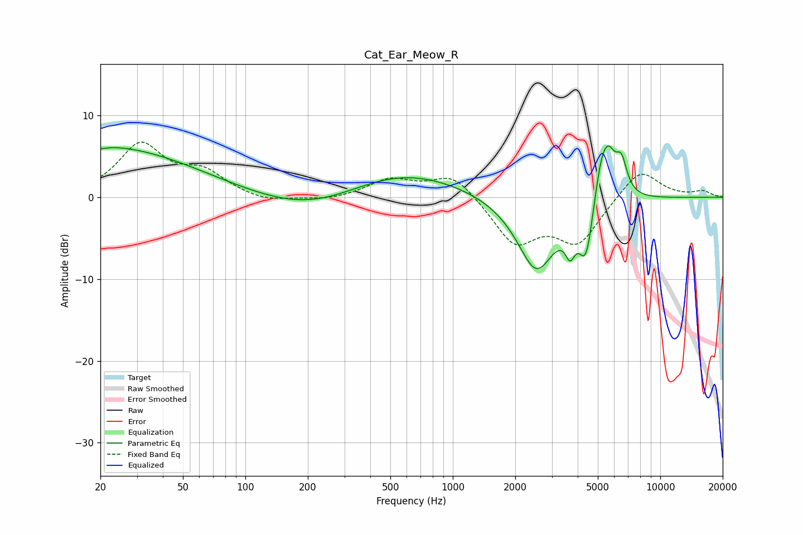

# Cat_Ear_Meow_R
See [usage instructions](https://github.com/jaakkopasanen/AutoEq#usage) for more options and info.

### Parametric EQs
Apply preamp of -6.4 dB when using parametric equalizer.

|   # | Type    |   Fc (Hz) |    Q |   Gain (dB) |
|-----|---------|-----------|------|-------------|
|   1 | Peaking |        20 | 0.31 |         6.3 |
|   2 | Peaking |        20 | 5.01 |        -0.3 |
|   3 | Peaking |       220 | 0.54 |        -2.6 |
|   4 | Peaking |       536 | 0.47 |         3.6 |
|   5 | Peaking |      2527 | 1.48 |        -9.1 |
|   6 | Peaking |      3678 | 6    |        -3   |
|   7 | Peaking |      4391 | 3.99 |        -6.9 |
|   8 | Peaking |      5202 | 3.63 |         5.3 |
|   9 | Peaking |      5664 | 4.14 |         3.8 |
|  10 | Peaking |      6492 | 4.87 |         4   |

### Fixed Band EQs
When using fixed band (also called graphic) equalizer, apply preamp of **-6.8 dB** (if available) and set gains manually with these parameters.

|   # | Type    |   Fc (Hz) |    Q |   Gain (dB) |
|-----|---------|-----------|------|-------------|
|   1 | Peaking |        31 | 1.41 |         6.3 |
|   2 | Peaking |        62 | 1.41 |         2.7 |
|   3 | Peaking |       125 | 1.41 |        -0.7 |
|   4 | Peaking |       250 | 1.41 |        -0.5 |
|   5 | Peaking |       500 | 1.41 |         2.1 |
|   6 | Peaking |      1000 | 1.41 |         3   |
|   7 | Peaking |      2000 | 1.41 |        -5.5 |
|   8 | Peaking |      4000 | 1.41 |        -5.4 |
|   9 | Peaking |      8000 | 1.41 |         3.7 |
|  10 | Peaking |     16000 | 1.41 |         0.7 |

### Graphs

