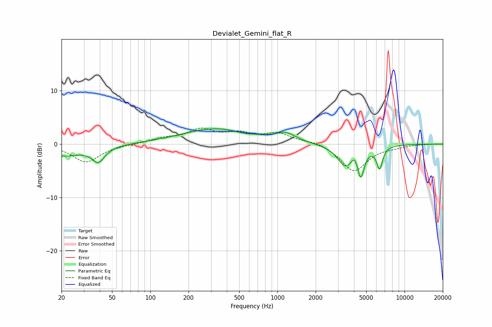

# Devialet_Gemini_flat_R
See [usage instructions](https://github.com/jaakkopasanen/AutoEq#usage) for more options and info.

### Parametric EQs
Apply preamp of -3.0 dB when using parametric equalizer.

|   # | Type    |   Fc (Hz) |    Q |   Gain (dB) |
|-----|---------|-----------|------|-------------|
|   1 | Peaking |        20 | 1    |        -2.1 |
|   2 | Peaking |        36 | 1.2  |        -0.3 |
|   3 | Peaking |        39 | 2.96 |        -2.6 |
|   4 | Peaking |       336 | 0.51 |         2.9 |
|   5 | Peaking |       538 | 1.89 |        -0.4 |
|   6 | Peaking |      1159 | 1.81 |         1.5 |
|   7 | Peaking |      3461 | 2.13 |        -4.2 |
|   8 | Peaking |      4116 | 4.13 |         2.3 |
|   9 | Peaking |      4505 | 4.95 |        -5.8 |
|  10 | Peaking |      6370 | 5.93 |        -4.1 |

### Fixed Band EQs
When using fixed band (also called graphic) equalizer, apply preamp of **-3.1 dB** (if available) and set gains manually with these parameters.

|   # | Type    |   Fc (Hz) |    Q |   Gain (dB) |
|-----|---------|-----------|------|-------------|
|   1 | Peaking |        31 | 1.41 |        -3.4 |
|   2 | Peaking |        62 | 1.41 |        -0.1 |
|   3 | Peaking |       125 | 1.41 |         0.9 |
|   4 | Peaking |       250 | 1.41 |         2.5 |
|   5 | Peaking |       500 | 1.41 |         1.7 |
|   6 | Peaking |      1000 | 1.41 |         1.8 |
|   7 | Peaking |      2000 | 1.41 |         0.6 |
|   8 | Peaking |      4000 | 1.41 |        -5.1 |
|   9 | Peaking |      8000 | 1.41 |        -0.4 |
|  10 | Peaking |     16000 | 1.41 |         0   |

### Graphs

