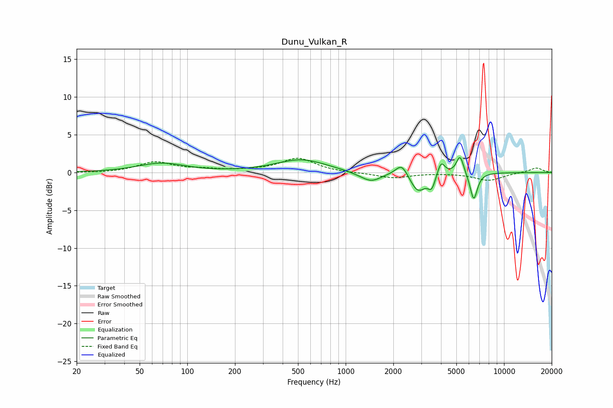

# Dunu_Vulkan_R
See [usage instructions](https://github.com/jaakkopasanen/AutoEq#usage) for more options and info.

### Parametric EQs
Apply preamp of -2.1 dB when using parametric equalizer.

|   # | Type    |   Fc (Hz) |    Q |   Gain (dB) |
|-----|---------|-----------|------|-------------|
|   1 | Peaking |        69 | 0.96 |         1.2 |
|   2 | Peaking |       524 | 0.89 |         1.7 |
|   3 | Peaking |      1233 | 1.82 |        -0.2 |
|   4 | Peaking |      1457 | 2.29 |        -1.1 |
|   5 | Peaking |      2261 | 3.74 |         1.7 |
|   6 | Peaking |      2856 | 2.9  |        -2.5 |
|   7 | Peaking |      3494 | 6    |        -1.7 |
|   8 | Peaking |      4004 | 6    |         1.9 |
|   9 | Peaking |      5277 | 6    |         2.5 |
|  10 | Peaking |      6435 | 5.91 |        -3.7 |

### Fixed Band EQs
When using fixed band (also called graphic) equalizer, apply preamp of **-2.0 dB** (if available) and set gains manually with these parameters.

|   # | Type    |   Fc (Hz) |    Q |   Gain (dB) |
|-----|---------|-----------|------|-------------|
|   1 | Peaking |        31 | 1.41 |        -0.1 |
|   2 | Peaking |        62 | 1.41 |         1.4 |
|   3 | Peaking |       125 | 1.41 |         0.3 |
|   4 | Peaking |       250 | 1.41 |         0.2 |
|   5 | Peaking |       500 | 1.41 |         1.9 |
|   6 | Peaking |      1000 | 1.41 |        -0.1 |
|   7 | Peaking |      2000 | 1.41 |        -0.7 |
|   8 | Peaking |      4000 | 1.41 |        -0   |
|   9 | Peaking |      8000 | 1.41 |        -1   |
|  10 | Peaking |     16000 | 1.41 |         0.6 |

### Graphs

