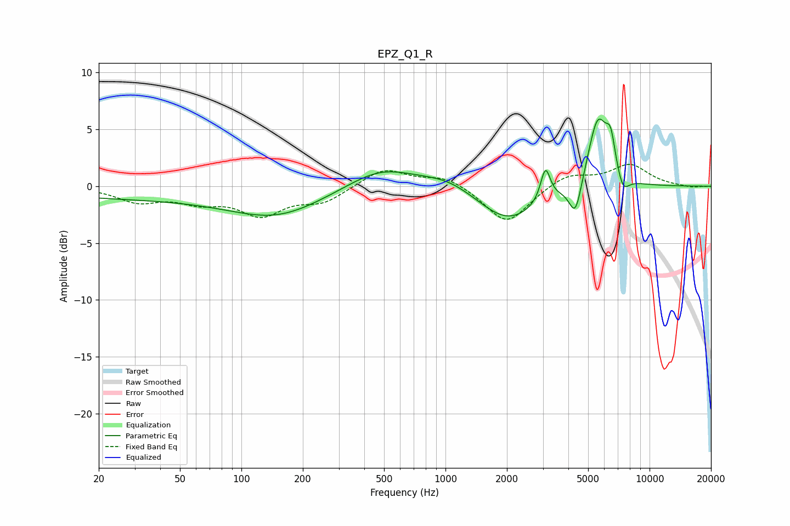

# EPZ_Q1_R
See [usage instructions](https://github.com/jaakkopasanen/AutoEq#usage) for more options and info.

### Parametric EQs
Apply preamp of -6.0 dB when using parametric equalizer.

|   # | Type    |   Fc (Hz) |    Q |   Gain (dB) |
|-----|---------|-----------|------|-------------|
|   1 | Peaking |        46 | 0.18 |        -1.1 |
|   2 | Peaking |       150 | 0.65 |        -1.9 |
|   3 | Peaking |       480 | 0.86 |         1.8 |
|   4 | Peaking |      1031 | 1.05 |         1   |
|   5 | Peaking |      2027 | 0.95 |        -3.2 |
|   6 | Peaking |      3089 | 6    |         2.9 |
|   7 | Peaking |      4335 | 4.6  |        -3.1 |
|   8 | Peaking |      5580 | 2.78 |         6.2 |
|   9 | Peaking |      6451 | 5.97 |         2.7 |
|  10 | Peaking |      7400 | 4.55 |        -1.6 |

### Fixed Band EQs
When using fixed band (also called graphic) equalizer, apply preamp of **-2.0 dB** (if available) and set gains manually with these parameters.

|   # | Type    |   Fc (Hz) |    Q |   Gain (dB) |
|-----|---------|-----------|------|-------------|
|   1 | Peaking |        31 | 1.41 |        -1.2 |
|   2 | Peaking |        62 | 1.41 |        -1.1 |
|   3 | Peaking |       125 | 1.41 |        -2.3 |
|   4 | Peaking |       250 | 1.41 |        -1.3 |
|   5 | Peaking |       500 | 1.41 |         1.6 |
|   6 | Peaking |      1000 | 1.41 |         0.9 |
|   7 | Peaking |      2000 | 1.41 |        -3.3 |
|   8 | Peaking |      4000 | 1.41 |         1.1 |
|   9 | Peaking |      8000 | 1.41 |         1.8 |
|  10 | Peaking |     16000 | 1.41 |        -0.1 |

### Graphs

