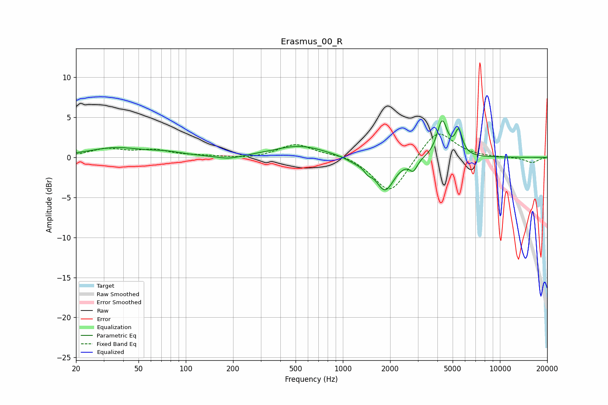

# Erasmus_00_R
See [usage instructions](https://github.com/jaakkopasanen/AutoEq#usage) for more options and info.

### Parametric EQs
Apply preamp of -4.7 dB when using parametric equalizer.

|   # | Type    |   Fc (Hz) |    Q |   Gain (dB) |
|-----|---------|-----------|------|-------------|
|   1 | Peaking |        36 | 0.83 |         1.2 |
|   2 | Peaking |        75 | 1.37 |         0.4 |
|   3 | Peaking |       188 | 1.86 |        -0.4 |
|   4 | Peaking |       531 | 0.85 |         1.5 |
|   5 | Peaking |      1203 | 2.23 |        -0.5 |
|   6 | Peaking |      1443 | 6    |        -0.7 |
|   7 | Peaking |      1855 | 2.4  |        -4.1 |
|   8 | Peaking |      2812 | 5.98 |        -1.3 |
|   9 | Peaking |      4288 | 4.3  |         4.5 |
|  10 | Peaking |      5465 | 5.99 |         2.9 |

### Fixed Band EQs
When using fixed band (also called graphic) equalizer, apply preamp of **-3.0 dB** (if available) and set gains manually with these parameters.

|   # | Type    |   Fc (Hz) |    Q |   Gain (dB) |
|-----|---------|-----------|------|-------------|
|   1 | Peaking |        31 | 1.41 |         1   |
|   2 | Peaking |        62 | 1.41 |         0.8 |
|   3 | Peaking |       125 | 1.41 |         0.1 |
|   4 | Peaking |       250 | 1.41 |        -0.2 |
|   5 | Peaking |       500 | 1.41 |         1.7 |
|   6 | Peaking |      1000 | 1.41 |         0.4 |
|   7 | Peaking |      2000 | 1.41 |        -4.7 |
|   8 | Peaking |      4000 | 1.41 |         3.7 |
|   9 | Peaking |      8000 | 1.41 |        -0   |
|  10 | Peaking |     16000 | 1.41 |        -0.7 |

### Graphs

