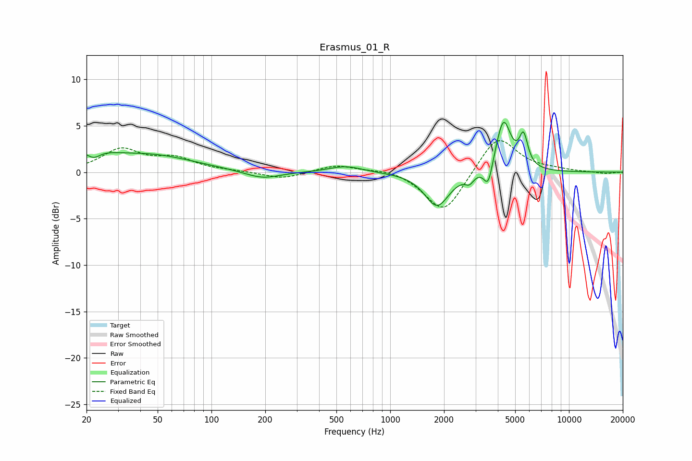

# Erasmus_01_R
See [usage instructions](https://github.com/jaakkopasanen/AutoEq#usage) for more options and info.

### Parametric EQs
Apply preamp of -5.5 dB when using parametric equalizer.

|   # | Type    |   Fc (Hz) |    Q |   Gain (dB) |
|-----|---------|-----------|------|-------------|
|   1 | Peaking |        20 | 1.15 |         1.7 |
|   2 | Peaking |        22 | 3.85 |        -0.9 |
|   3 | Peaking |        46 | 0.57 |         1.7 |
|   4 | Peaking |       193 | 1.41 |        -0.8 |
|   5 | Peaking |       563 | 1.52 |         0.7 |
|   6 | Peaking |      1827 | 2.08 |        -3.7 |
|   7 | Peaking |      2774 | 6    |        -0.8 |
|   8 | Peaking |      3534 | 5.9  |        -2.5 |
|   9 | Peaking |      4297 | 3.36 |         5.7 |
|  10 | Peaking |      5570 | 5.86 |         3.3 |

### Fixed Band EQs
When using fixed band (also called graphic) equalizer, apply preamp of **-3.5 dB** (if available) and set gains manually with these parameters.

|   # | Type    |   Fc (Hz) |    Q |   Gain (dB) |
|-----|---------|-----------|------|-------------|
|   1 | Peaking |        31 | 1.41 |         2.4 |
|   2 | Peaking |        62 | 1.41 |         1.3 |
|   3 | Peaking |       125 | 1.41 |         0.1 |
|   4 | Peaking |       250 | 1.41 |        -0.7 |
|   5 | Peaking |       500 | 1.41 |         0.8 |
|   6 | Peaking |      1000 | 1.41 |         0.4 |
|   7 | Peaking |      2000 | 1.41 |        -4.6 |
|   8 | Peaking |      4000 | 1.41 |         4.1 |
|   9 | Peaking |      8000 | 1.41 |         0.2 |
|  10 | Peaking |     16000 | 1.41 |        -0.2 |

### Graphs

