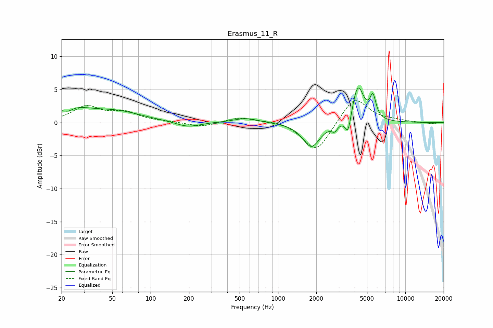

# Erasmus_11_R
See [usage instructions](https://github.com/jaakkopasanen/AutoEq#usage) for more options and info.

### Parametric EQs
Apply preamp of -5.3 dB when using parametric equalizer.

|   # | Type    |   Fc (Hz) |    Q |   Gain (dB) |
|-----|---------|-----------|------|-------------|
|   1 | Peaking |        22 | 3.46 |        -0.8 |
|   2 | Peaking |        23 | 0.96 |         2   |
|   3 | Peaking |        54 | 0.71 |         1.5 |
|   4 | Peaking |       196 | 1.52 |        -0.8 |
|   5 | Peaking |       560 | 1.5  |         0.7 |
|   6 | Peaking |      1829 | 2.07 |        -3.7 |
|   7 | Peaking |      2782 | 6    |        -1   |
|   8 | Peaking |      3550 | 5.88 |        -3.1 |
|   9 | Peaking |      4238 | 3.05 |         5.7 |
|  10 | Peaking |      5566 | 5.96 |         3.2 |

### Fixed Band EQs
When using fixed band (also called graphic) equalizer, apply preamp of **-3.4 dB** (if available) and set gains manually with these parameters.

|   # | Type    |   Fc (Hz) |    Q |   Gain (dB) |
|-----|---------|-----------|------|-------------|
|   1 | Peaking |        31 | 1.41 |         2.3 |
|   2 | Peaking |        62 | 1.41 |         1.4 |
|   3 | Peaking |       125 | 1.41 |         0.1 |
|   4 | Peaking |       250 | 1.41 |        -0.7 |
|   5 | Peaking |       500 | 1.41 |         0.8 |
|   6 | Peaking |      1000 | 1.41 |         0.4 |
|   7 | Peaking |      2000 | 1.41 |        -4.6 |
|   8 | Peaking |      4000 | 1.41 |         4   |
|   9 | Peaking |      8000 | 1.41 |         0.3 |
|  10 | Peaking |     16000 | 1.41 |        -0.2 |

### Graphs

