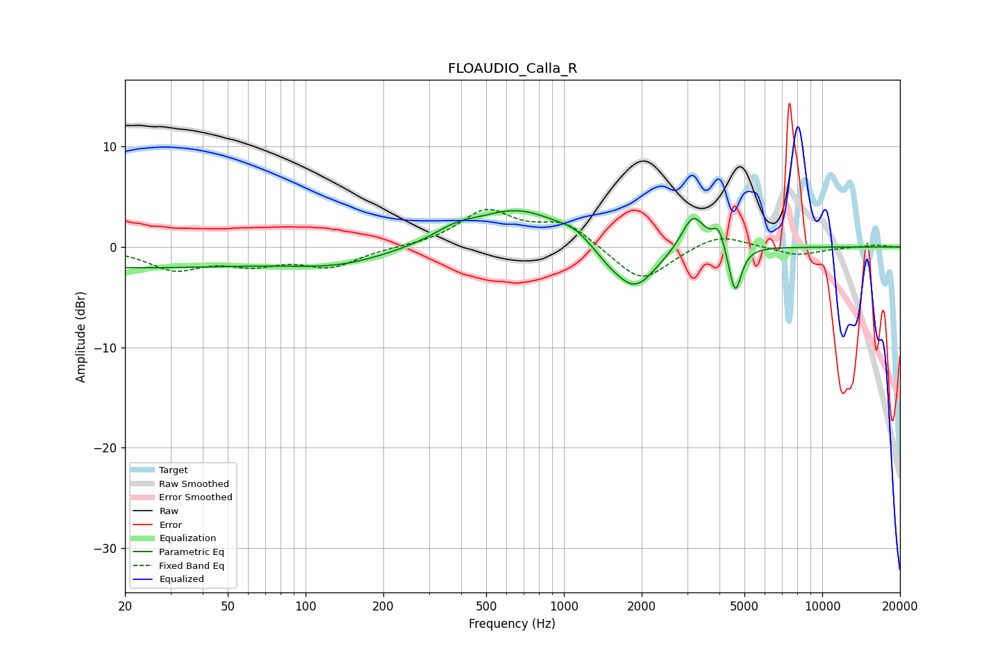

# FLOAUDIO_Calla_R
See [usage instructions](https://github.com/jaakkopasanen/AutoEq#usage) for more options and info.

### Parametric EQs
Apply preamp of -3.7 dB when using parametric equalizer.

|   # | Type    |   Fc (Hz) |    Q |   Gain (dB) |
|-----|---------|-----------|------|-------------|
|   1 | Peaking |        20 | 0.24 |        -2   |
|   2 | Peaking |       135 | 0.7  |        -1.5 |
|   3 | Peaking |       379 | 1.71 |         1   |
|   4 | Peaking |       665 | 0.81 |         3.7 |
|   5 | Peaking |      1099 | 2.41 |         0.8 |
|   6 | Peaking |      1484 | 2.35 |        -0.8 |
|   7 | Peaking |      1882 | 1.69 |        -4.4 |
|   8 | Peaking |      3161 | 3.19 |         3.6 |
|   9 | Peaking |      3972 | 6    |         2   |
|  10 | Peaking |      4602 | 5.9  |        -4.8 |

### Fixed Band EQs
When using fixed band (also called graphic) equalizer, apply preamp of **-3.8 dB** (if available) and set gains manually with these parameters.

|   # | Type    |   Fc (Hz) |    Q |   Gain (dB) |
|-----|---------|-----------|------|-------------|
|   1 | Peaking |        31 | 1.41 |        -2.1 |
|   2 | Peaking |        62 | 1.41 |        -1.4 |
|   3 | Peaking |       125 | 1.41 |        -1.9 |
|   4 | Peaking |       250 | 1.41 |        -0   |
|   5 | Peaking |       500 | 1.41 |         3.5 |
|   6 | Peaking |      1000 | 1.41 |         2.3 |
|   7 | Peaking |      2000 | 1.41 |        -3.6 |
|   8 | Peaking |      4000 | 1.41 |         1.4 |
|   9 | Peaking |      8000 | 1.41 |        -0.8 |
|  10 | Peaking |     16000 | 1.41 |         0.2 |

### Graphs

