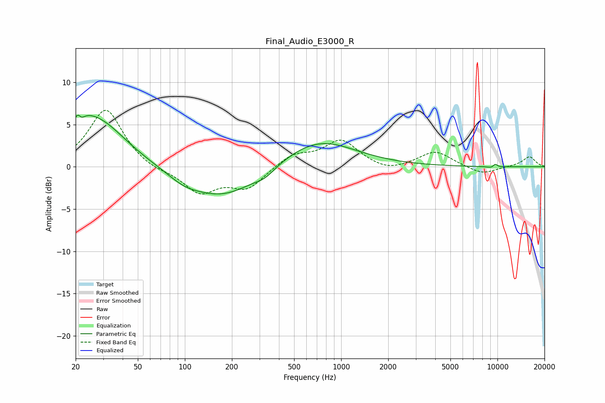

# Final_Audio_E3000_R
See [usage instructions](https://github.com/jaakkopasanen/AutoEq#usage) for more options and info.

### Parametric EQs
Apply preamp of -6.2 dB when using parametric equalizer.

|   # | Type    |   Fc (Hz) |    Q |   Gain (dB) |
|-----|---------|-----------|------|-------------|
|   1 | Peaking |        21 | 5.81 |         3.3 |
|   2 | Peaking |        21 | 5.97 |        -2.9 |
|   3 | Peaking |        22 | 1.95 |         1.3 |
|   4 | Peaking |        28 | 0.78 |         5.3 |
|   5 | Peaking |        98 | 1.48 |        -0.8 |
|   6 | Peaking |       174 | 0.61 |        -3.7 |
|   7 | Peaking |       326 | 2.37 |        -0.7 |
|   8 | Peaking |       709 | 0.61 |         3.3 |
|   9 | Peaking |      9593 | 5.39 |        -2.5 |
|  10 | Peaking |      9623 | 5.99 |         2.7 |

### Fixed Band EQs
When using fixed band (also called graphic) equalizer, apply preamp of **-6.8 dB** (if available) and set gains manually with these parameters.

|   # | Type    |   Fc (Hz) |    Q |   Gain (dB) |
|-----|---------|-----------|------|-------------|
|   1 | Peaking |        31 | 1.41 |         6.9 |
|   2 | Peaking |        62 | 1.41 |        -0.6 |
|   3 | Peaking |       125 | 1.41 |        -3   |
|   4 | Peaking |       250 | 1.41 |        -2.5 |
|   5 | Peaking |       500 | 1.41 |         1.4 |
|   6 | Peaking |      1000 | 1.41 |         3.1 |
|   7 | Peaking |      2000 | 1.41 |        -0.7 |
|   8 | Peaking |      4000 | 1.41 |         1.8 |
|   9 | Peaking |      8000 | 1.41 |        -0.9 |
|  10 | Peaking |     16000 | 1.41 |         1.2 |

### Graphs

