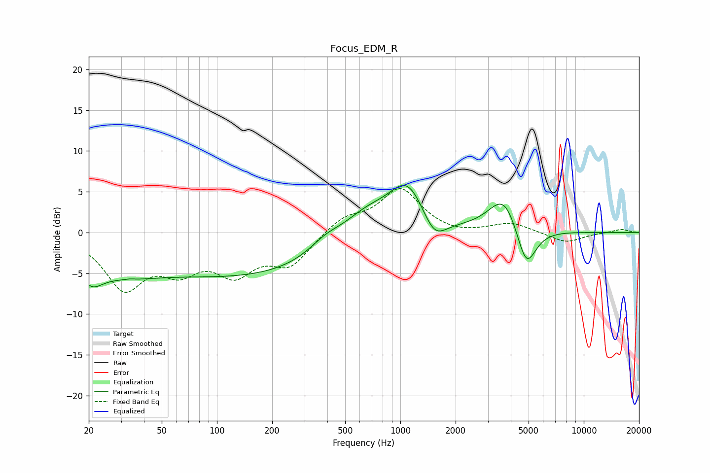

# Focus_EDM_R
See [usage instructions](https://github.com/jaakkopasanen/AutoEq#usage) for more options and info.

### Parametric EQs
Apply preamp of -5.9 dB when using parametric equalizer.

|   # | Type    |   Fc (Hz) |    Q |   Gain (dB) |
|-----|---------|-----------|------|-------------|
|   1 | Peaking |        20 | 2.21 |        -2.8 |
|   2 | Peaking |        29 | 0.65 |        -3.1 |
|   3 | Peaking |        33 | 5.93 |         0.1 |
|   4 | Peaking |       149 | 0.26 |        -5.2 |
|   5 | Peaking |       391 | 1.48 |         1.6 |
|   6 | Peaking |       644 | 1.04 |         3.2 |
|   7 | Peaking |      1096 | 1.33 |         6.2 |
|   8 | Peaking |      1526 | 2.13 |        -3.2 |
|   9 | Peaking |      3686 | 1.68 |         4.8 |
|  10 | Peaking |      4849 | 2.57 |        -5.6 |

### Fixed Band EQs
When using fixed band (also called graphic) equalizer, apply preamp of **-5.5 dB** (if available) and set gains manually with these parameters.

|   # | Type    |   Fc (Hz) |    Q |   Gain (dB) |
|-----|---------|-----------|------|-------------|
|   1 | Peaking |        31 | 1.41 |        -6.5 |
|   2 | Peaking |        62 | 1.41 |        -3.7 |
|   3 | Peaking |       125 | 1.41 |        -4.4 |
|   4 | Peaking |       250 | 1.41 |        -3.7 |
|   5 | Peaking |       500 | 1.41 |         1.8 |
|   6 | Peaking |      1000 | 1.41 |         5.3 |
|   7 | Peaking |      2000 | 1.41 |        -0.4 |
|   8 | Peaking |      4000 | 1.41 |         1.2 |
|   9 | Peaking |      8000 | 1.41 |        -1.3 |
|  10 | Peaking |     16000 | 1.41 |         0.4 |

### Graphs

