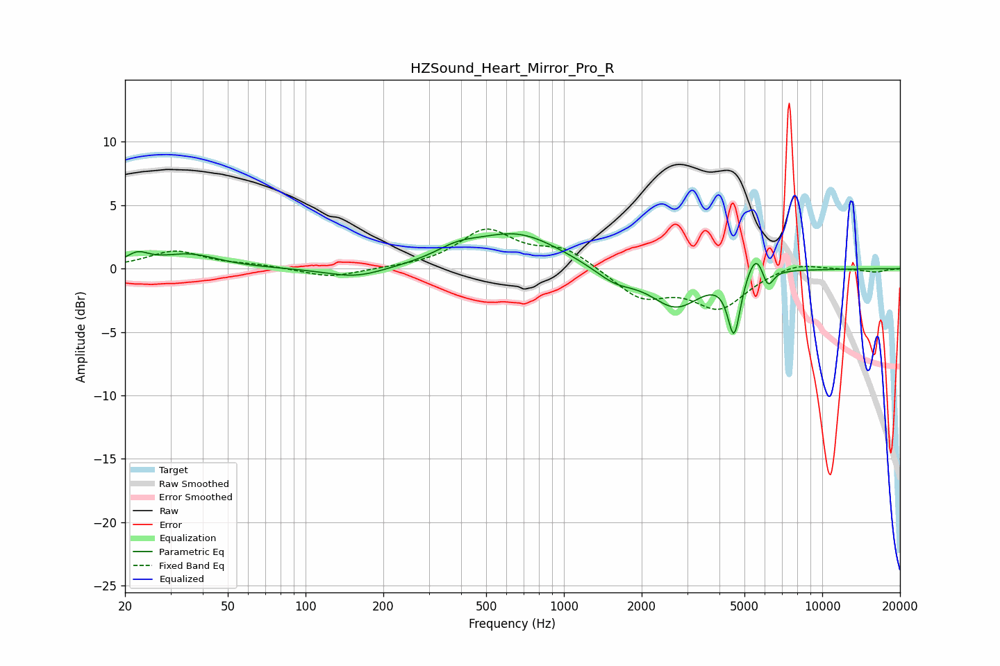

# HZSound_Heart_Mirror_Pro_R
See [usage instructions](https://github.com/jaakkopasanen/AutoEq#usage) for more options and info.

### Parametric EQs
Apply preamp of -2.8 dB when using parametric equalizer.

|   # | Type    |   Fc (Hz) |    Q |   Gain (dB) |
|-----|---------|-----------|------|-------------|
|   1 | Peaking |        22 | 3.24 |         0.9 |
|   2 | Peaking |        35 | 1.26 |         1.1 |
|   3 | Peaking |       156 | 1.22 |        -0.8 |
|   4 | Peaking |       387 | 1.64 |         0.8 |
|   5 | Peaking |       661 | 0.83 |         2.7 |
|   6 | Peaking |      1575 | 1.77 |        -1.1 |
|   7 | Peaking |      2713 | 1.43 |        -3   |
|   8 | Peaking |      4558 | 5.76 |        -4.8 |
|   9 | Peaking |      5557 | 3.84 |         2.1 |
|  10 | Peaking |      6144 | 6    |        -1.7 |

### Fixed Band EQs
When using fixed band (also called graphic) equalizer, apply preamp of **-3.2 dB** (if available) and set gains manually with these parameters.

|   # | Type    |   Fc (Hz) |    Q |   Gain (dB) |
|-----|---------|-----------|------|-------------|
|   1 | Peaking |        31 | 1.41 |         1.4 |
|   2 | Peaking |        62 | 1.41 |         0.2 |
|   3 | Peaking |       125 | 1.41 |        -0.7 |
|   4 | Peaking |       250 | 1.41 |         0   |
|   5 | Peaking |       500 | 1.41 |         3   |
|   6 | Peaking |      1000 | 1.41 |         1.5 |
|   7 | Peaking |      2000 | 1.41 |        -2.2 |
|   8 | Peaking |      4000 | 1.41 |        -3   |
|   9 | Peaking |      8000 | 1.41 |         0.6 |
|  10 | Peaking |     16000 | 1.41 |        -0.3 |

### Graphs

