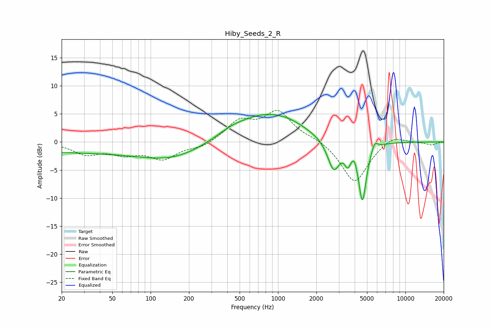

# Hiby_Seeds_2_R
See [usage instructions](https://github.com/jaakkopasanen/AutoEq#usage) for more options and info.

### Parametric EQs
Apply preamp of -5.0 dB when using parametric equalizer.

|   # | Type    |   Fc (Hz) |    Q |   Gain (dB) |
|-----|---------|-----------|------|-------------|
|   1 | Peaking |        28 | 0.18 |        -1.8 |
|   2 | Peaking |       154 | 0.58 |        -2.3 |
|   3 | Peaking |       430 | 1.38 |         0.7 |
|   4 | Peaking |       786 | 0.57 |         4.7 |
|   5 | Peaking |      1248 | 1.05 |         0.8 |
|   6 | Peaking |      2734 | 2.92 |        -5.5 |
|   7 | Peaking |      3526 | 5.99 |        -2.5 |
|   8 | Peaking |      3982 | 6    |         1.2 |
|   9 | Peaking |      4600 | 4.41 |       -10.6 |
|  10 | Peaking |      5728 | 5.55 |         1.6 |

### Fixed Band EQs
When using fixed band (also called graphic) equalizer, apply preamp of **-5.7 dB** (if available) and set gains manually with these parameters.

|   # | Type    |   Fc (Hz) |    Q |   Gain (dB) |
|-----|---------|-----------|------|-------------|
|   1 | Peaking |        31 | 1.41 |        -2   |
|   2 | Peaking |        62 | 1.41 |        -1.8 |
|   3 | Peaking |       125 | 1.41 |        -2.8 |
|   4 | Peaking |       250 | 1.41 |        -1   |
|   5 | Peaking |       500 | 1.41 |         3.5 |
|   6 | Peaking |      1000 | 1.41 |         5.2 |
|   7 | Peaking |      2000 | 1.41 |         0.6 |
|   8 | Peaking |      4000 | 1.41 |        -7.4 |
|   9 | Peaking |      8000 | 1.41 |         1.4 |
|  10 | Peaking |     16000 | 1.41 |        -0.5 |

### Graphs

