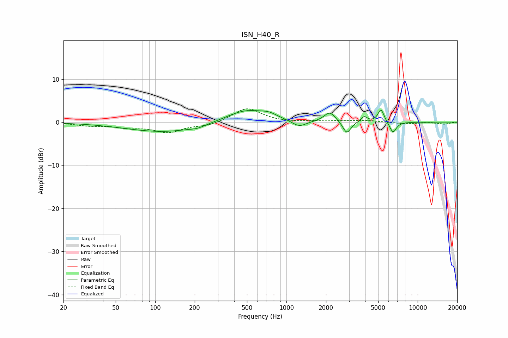

# ISN_H40_R
See [usage instructions](https://github.com/jaakkopasanen/AutoEq#usage) for more options and info.

### Parametric EQs
Apply preamp of -2.9 dB when using parametric equalizer.

|   # | Type    |   Fc (Hz) |    Q |   Gain (dB) |
|-----|---------|-----------|------|-------------|
|   1 | Peaking |       121 | 0.47 |        -2.3 |
|   2 | Peaking |       210 | 2.83 |        -0.4 |
|   3 | Peaking |       493 | 0.87 |         3.1 |
|   4 | Peaking |       737 | 2.62 |         0.8 |
|   5 | Peaking |      1248 | 2.5  |        -1.6 |
|   6 | Peaking |      2139 | 3.31 |         2.3 |
|   7 | Peaking |      2884 | 4.63 |        -2.9 |
|   8 | Peaking |      3915 | 6    |         1.3 |
|   9 | Peaking |      5252 | 6    |         3.1 |
|  10 | Peaking |      6480 | 5.4  |        -2.6 |

### Fixed Band EQs
When using fixed band (also called graphic) equalizer, apply preamp of **-3.2 dB** (if available) and set gains manually with these parameters.

|   # | Type    |   Fc (Hz) |    Q |   Gain (dB) |
|-----|---------|-----------|------|-------------|
|   1 | Peaking |        31 | 1.41 |        -0.7 |
|   2 | Peaking |        62 | 1.41 |        -1   |
|   3 | Peaking |       125 | 1.41 |        -2.2 |
|   4 | Peaking |       250 | 1.41 |        -0.8 |
|   5 | Peaking |       500 | 1.41 |         3.3 |
|   6 | Peaking |      1000 | 1.41 |        -0.1 |
|   7 | Peaking |      2000 | 1.41 |         0.3 |
|   8 | Peaking |      4000 | 1.41 |         0.4 |
|   9 | Peaking |      8000 | 1.41 |        -0.4 |
|  10 | Peaking |     16000 | 1.41 |        -0.5 |

### Graphs

