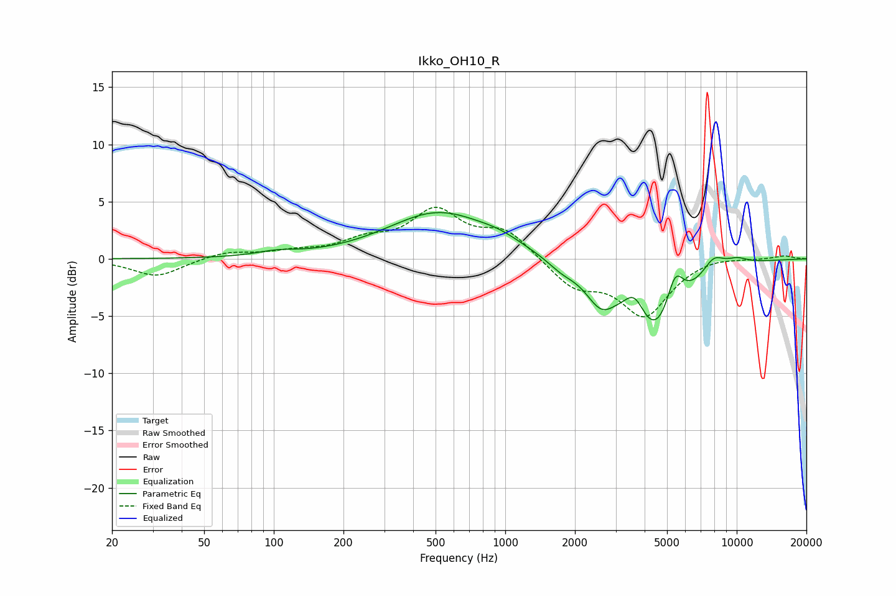

# Ikko_OH10_R
See [usage instructions](https://github.com/jaakkopasanen/AutoEq#usage) for more options and info.

### Parametric EQs
Apply preamp of -4.1 dB when using parametric equalizer.

|   # | Type    |   Fc (Hz) |    Q |   Gain (dB) |
|-----|---------|-----------|------|-------------|
|   1 | Peaking |       103 | 1.61 |         0.4 |
|   2 | Peaking |       516 | 0.64 |         4   |
|   3 | Peaking |       950 | 1.52 |         0.6 |
|   4 | Peaking |      1753 | 2.27 |        -0.8 |
|   5 | Peaking |      2582 | 2.18 |        -2.6 |
|   6 | Peaking |      3631 | 3.13 |         2.3 |
|   7 | Peaking |      4437 | 1.16 |        -7   |
|   8 | Peaking |      5415 | 3.67 |         3.4 |
|   9 | Peaking |      7943 | 2.89 |         1.4 |
|  10 | Peaking |     10000 | 2.35 |         0.6 |

### Fixed Band EQs
When using fixed band (also called graphic) equalizer, apply preamp of **-4.6 dB** (if available) and set gains manually with these parameters.

|   # | Type    |   Fc (Hz) |    Q |   Gain (dB) |
|-----|---------|-----------|------|-------------|
|   1 | Peaking |        31 | 1.41 |        -1.6 |
|   2 | Peaking |        62 | 1.41 |         0.6 |
|   3 | Peaking |       125 | 1.41 |         0.5 |
|   4 | Peaking |       250 | 1.41 |         1.3 |
|   5 | Peaking |       500 | 1.41 |         3.9 |
|   6 | Peaking |      1000 | 1.41 |         2.3 |
|   7 | Peaking |      2000 | 1.41 |        -2.3 |
|   8 | Peaking |      4000 | 1.41 |        -4.8 |
|   9 | Peaking |      8000 | 1.41 |         0.3 |
|  10 | Peaking |     16000 | 1.41 |         0.3 |

### Graphs

