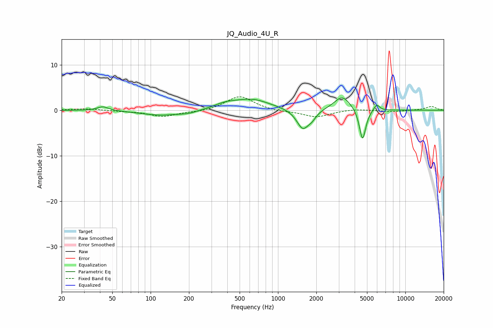

# JQ_Audio_4U_R
See [usage instructions](https://github.com/jaakkopasanen/AutoEq#usage) for more options and info.

### Parametric EQs
Apply preamp of -2.8 dB when using parametric equalizer.

|   # | Type    |   Fc (Hz) |    Q |   Gain (dB) |
|-----|---------|-----------|------|-------------|
|   1 | Peaking |        42 | 3.23 |         0.9 |
|   2 | Peaking |       121 | 0.88 |        -1.1 |
|   3 | Peaking |       200 | 2.11 |        -0.5 |
|   4 | Peaking |       384 | 1.68 |         0.9 |
|   5 | Peaking |       621 | 0.98 |         2.3 |
|   6 | Peaking |      1567 | 2.91 |        -4.3 |
|   7 | Peaking |      1856 | 4.4  |        -1.1 |
|   8 | Peaking |      3197 | 2.17 |         3.2 |
|   9 | Peaking |      4613 | 5.63 |        -7   |
|  10 | Peaking |      5947 | 6    |         1.5 |

### Fixed Band EQs
When using fixed band (also called graphic) equalizer, apply preamp of **-3.0 dB** (if available) and set gains manually with these parameters.

|   # | Type    |   Fc (Hz) |    Q |   Gain (dB) |
|-----|---------|-----------|------|-------------|
|   1 | Peaking |        31 | 1.41 |         0.3 |
|   2 | Peaking |        62 | 1.41 |        -0.2 |
|   3 | Peaking |       125 | 1.41 |        -1.4 |
|   4 | Peaking |       250 | 1.41 |        -0.3 |
|   5 | Peaking |       500 | 1.41 |         3.2 |
|   6 | Peaking |      1000 | 1.41 |        -0.3 |
|   7 | Peaking |      2000 | 1.41 |        -1.5 |
|   8 | Peaking |      4000 | 1.41 |         0.3 |
|   9 | Peaking |      8000 | 1.41 |        -0.3 |
|  10 | Peaking |     16000 | 1.41 |         0.8 |

### Graphs

