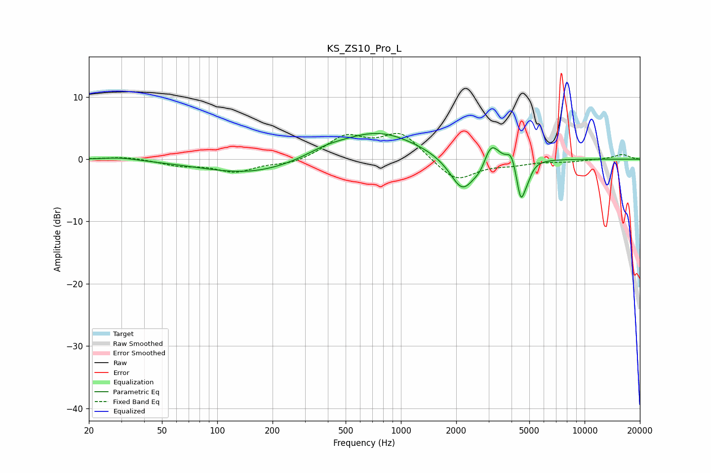

# KS_ZS10_Pro_L
See [usage instructions](https://github.com/jaakkopasanen/AutoEq#usage) for more options and info.

### Parametric EQs
Apply preamp of -4.2 dB when using parametric equalizer.

|   # | Type    |   Fc (Hz) |    Q |   Gain (dB) |
|-----|---------|-----------|------|-------------|
|   1 | Peaking |        29 | 1.46 |         0.5 |
|   2 | Peaking |       154 | 0.52 |        -2.4 |
|   3 | Peaking |       386 | 1.29 |         0.9 |
|   4 | Peaking |       747 | 0.64 |         4.5 |
|   5 | Peaking |      2164 | 2.04 |        -5.8 |
|   6 | Peaking |      2724 | 3.9  |        -1.5 |
|   7 | Peaking |      3085 | 3.33 |         3.7 |
|   8 | Peaking |      3990 | 5.99 |         2   |
|   9 | Peaking |      4496 | 5.95 |        -6.2 |
|  10 | Peaking |      4900 | 6    |        -1.6 |

### Fixed Band EQs
When using fixed band (also called graphic) equalizer, apply preamp of **-4.2 dB** (if available) and set gains manually with these parameters.

|   # | Type    |   Fc (Hz) |    Q |   Gain (dB) |
|-----|---------|-----------|------|-------------|
|   1 | Peaking |        31 | 1.41 |         0.4 |
|   2 | Peaking |        62 | 1.41 |        -0.9 |
|   3 | Peaking |       125 | 1.41 |        -1.9 |
|   4 | Peaking |       250 | 1.41 |        -0.8 |
|   5 | Peaking |       500 | 1.41 |         3.5 |
|   6 | Peaking |      1000 | 1.41 |         4.1 |
|   7 | Peaking |      2000 | 1.41 |        -3.7 |
|   8 | Peaking |      4000 | 1.41 |        -0.7 |
|   9 | Peaking |      8000 | 1.41 |        -0.4 |
|  10 | Peaking |     16000 | 1.41 |         0.8 |

### Graphs

