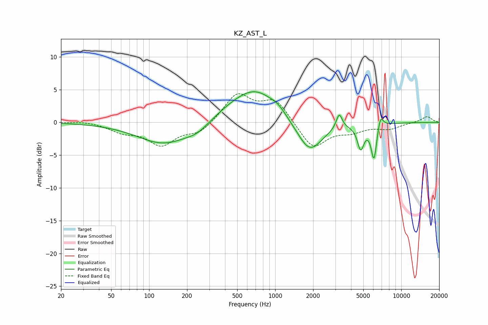

# KZ_AST_L
See [usage instructions](https://github.com/jaakkopasanen/AutoEq#usage) for more options and info.

### Parametric EQs
Apply preamp of -4.8 dB when using parametric equalizer.

|   # | Type    |   Fc (Hz) |    Q |   Gain (dB) |
|-----|---------|-----------|------|-------------|
|   1 | Peaking |       131 | 0.67 |        -3.3 |
|   2 | Peaking |       242 | 1.6  |        -1   |
|   3 | Peaking |       445 | 0.9  |         1.1 |
|   4 | Peaking |       709 | 0.83 |         4.6 |
|   5 | Peaking |      1060 | 2.5  |         0.7 |
|   6 | Peaking |      1875 | 1.4  |        -4.9 |
|   7 | Peaking |      3221 | 6    |         2.3 |
|   8 | Peaking |      4770 | 5.35 |        -3.6 |
|   9 | Peaking |      6081 | 5.99 |        -5.5 |
|  10 | Peaking |      6822 | 5.96 |         2.1 |

### Fixed Band EQs
When using fixed band (also called graphic) equalizer, apply preamp of **-4.5 dB** (if available) and set gains manually with these parameters.

|   # | Type    |   Fc (Hz) |    Q |   Gain (dB) |
|-----|---------|-----------|------|-------------|
|   1 | Peaking |        31 | 1.41 |         0.2 |
|   2 | Peaking |        62 | 1.41 |        -1.3 |
|   3 | Peaking |       125 | 1.41 |        -3.3 |
|   4 | Peaking |       250 | 1.41 |        -1.6 |
|   5 | Peaking |       500 | 1.41 |         4.3 |
|   6 | Peaking |      1000 | 1.41 |         3.4 |
|   7 | Peaking |      2000 | 1.41 |        -4.1 |
|   8 | Peaking |      4000 | 1.41 |        -1.2 |
|   9 | Peaking |      8000 | 1.41 |        -0.9 |
|  10 | Peaking |     16000 | 1.41 |         0.9 |

### Graphs

