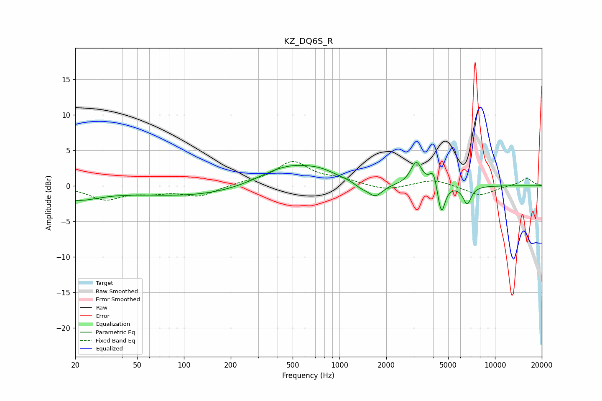

# KZ_DQ6S_R
See [usage instructions](https://github.com/jaakkopasanen/AutoEq#usage) for more options and info.

### Parametric EQs
Apply preamp of -3.4 dB when using parametric equalizer.

|   # | Type    |   Fc (Hz) |    Q |   Gain (dB) |
|-----|---------|-----------|------|-------------|
|   1 | Peaking |        20 | 0.91 |        -1.8 |
|   2 | Peaking |       139 | 0.31 |        -1.6 |
|   3 | Peaking |       472 | 0.68 |         3.4 |
|   4 | Peaking |       763 | 1.53 |         0.7 |
|   5 | Peaking |      1366 | 3.66 |        -0.5 |
|   6 | Peaking |      1694 | 2.89 |        -1.9 |
|   7 | Peaking |      3117 | 3.93 |         3.3 |
|   8 | Peaking |      4017 | 6    |         2.3 |
|   9 | Peaking |      4520 | 6    |        -4.3 |
|  10 | Peaking |      6628 | 5.23 |        -2.5 |

### Fixed Band EQs
When using fixed band (also called graphic) equalizer, apply preamp of **-3.5 dB** (if available) and set gains manually with these parameters.

|   # | Type    |   Fc (Hz) |    Q |   Gain (dB) |
|-----|---------|-----------|------|-------------|
|   1 | Peaking |        31 | 1.41 |        -1.8 |
|   2 | Peaking |        62 | 1.41 |        -0.7 |
|   3 | Peaking |       125 | 1.41 |        -1.4 |
|   4 | Peaking |       250 | 1.41 |         0.4 |
|   5 | Peaking |       500 | 1.41 |         3.3 |
|   6 | Peaking |      1000 | 1.41 |         0.8 |
|   7 | Peaking |      2000 | 1.41 |        -0.7 |
|   8 | Peaking |      4000 | 1.41 |         0.9 |
|   9 | Peaking |      8000 | 1.41 |        -1.4 |
|  10 | Peaking |     16000 | 1.41 |         1.1 |

### Graphs

