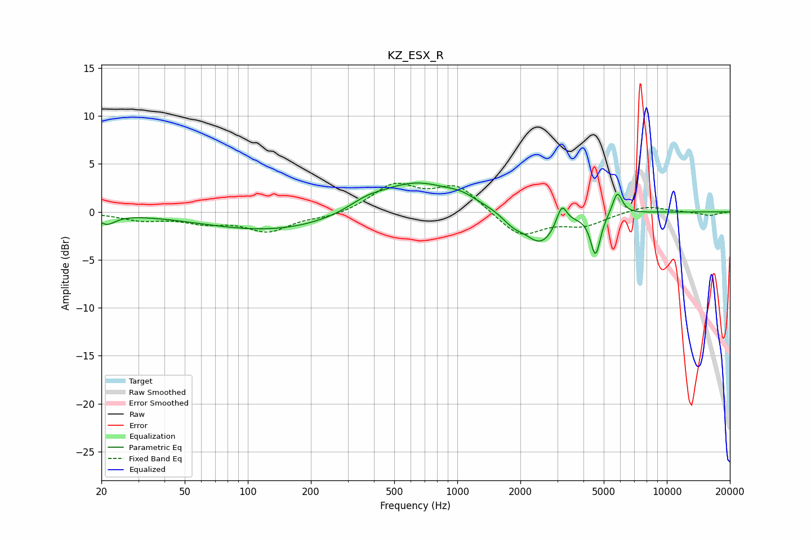

# KZ_ESX_R
See [usage instructions](https://github.com/jaakkopasanen/AutoEq#usage) for more options and info.

### Parametric EQs
Apply preamp of -3.1 dB when using parametric equalizer.

|   # | Type    |   Fc (Hz) |    Q |   Gain (dB) |
|-----|---------|-----------|------|-------------|
|   1 | Peaking |        21 | 3.53 |        -1.1 |
|   2 | Peaking |       137 | 0.41 |        -2.1 |
|   3 | Peaking |       367 | 1.75 |         0.7 |
|   4 | Peaking |       626 | 0.73 |         3.3 |
|   5 | Peaking |      1051 | 2.24 |         0.6 |
|   6 | Peaking |      1849 | 2.62 |        -1.1 |
|   7 | Peaking |      2507 | 1.89 |        -3.3 |
|   8 | Peaking |      3152 | 5.85 |         2.2 |
|   9 | Peaking |      4566 | 6    |        -4.3 |
|  10 | Peaking |      5808 | 6    |         2.4 |

### Fixed Band EQs
When using fixed band (also called graphic) equalizer, apply preamp of **-3.1 dB** (if available) and set gains manually with these parameters.

|   # | Type    |   Fc (Hz) |    Q |   Gain (dB) |
|-----|---------|-----------|------|-------------|
|   1 | Peaking |        31 | 1.41 |        -0.8 |
|   2 | Peaking |        62 | 1.41 |        -0.9 |
|   3 | Peaking |       125 | 1.41 |        -1.9 |
|   4 | Peaking |       250 | 1.41 |        -0.5 |
|   5 | Peaking |       500 | 1.41 |         2.7 |
|   6 | Peaking |      1000 | 1.41 |         2.7 |
|   7 | Peaking |      2000 | 1.41 |        -2.6 |
|   8 | Peaking |      4000 | 1.41 |        -1.3 |
|   9 | Peaking |      8000 | 1.41 |         0.7 |
|  10 | Peaking |     16000 | 1.41 |        -0.4 |

### Graphs

