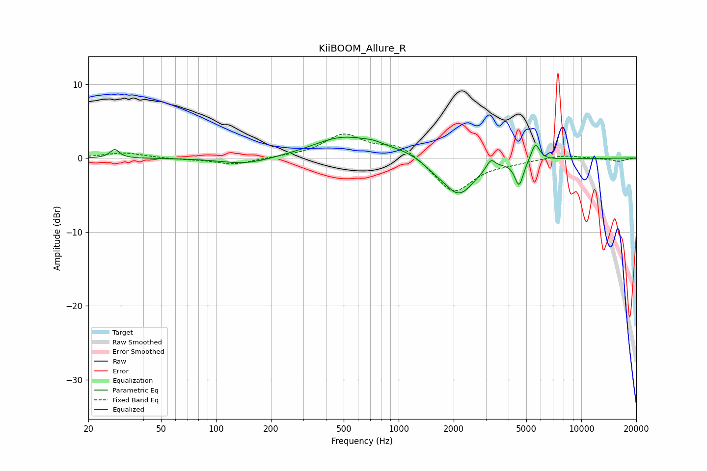

# KiiBOOM_Allure_R
See [usage instructions](https://github.com/jaakkopasanen/AutoEq#usage) for more options and info.

### Parametric EQs
Apply preamp of -2.9 dB when using parametric equalizer.

|   # | Type    |   Fc (Hz) |    Q |   Gain (dB) |
|-----|---------|-----------|------|-------------|
|   1 | Peaking |        28 | 5.76 |         1.2 |
|   2 | Peaking |       146 | 1.04 |        -0.9 |
|   3 | Peaking |       496 | 0.85 |         2.8 |
|   4 | Peaking |       730 | 2.49 |         0.5 |
|   5 | Peaking |      1072 | 1.31 |         0.7 |
|   6 | Peaking |      1550 | 2.58 |        -0.6 |
|   7 | Peaking |      2133 | 1.62 |        -5   |
|   8 | Peaking |      3195 | 5.99 |         1.4 |
|   9 | Peaking |      4564 | 6    |        -3.4 |
|  10 | Peaking |      5603 | 5.99 |         2.4 |

### Fixed Band EQs
When using fixed band (also called graphic) equalizer, apply preamp of **-3.4 dB** (if available) and set gains manually with these parameters.

|   # | Type    |   Fc (Hz) |    Q |   Gain (dB) |
|-----|---------|-----------|------|-------------|
|   1 | Peaking |        31 | 1.41 |         0.7 |
|   2 | Peaking |        62 | 1.41 |        -0.1 |
|   3 | Peaking |       125 | 1.41 |        -0.9 |
|   4 | Peaking |       250 | 1.41 |         0.1 |
|   5 | Peaking |       500 | 1.41 |         3.1 |
|   6 | Peaking |      1000 | 1.41 |         1.8 |
|   7 | Peaking |      2000 | 1.41 |        -4.8 |
|   8 | Peaking |      4000 | 1.41 |        -0.5 |
|   9 | Peaking |      8000 | 1.41 |         0.5 |
|  10 | Peaking |     16000 | 1.41 |        -0.4 |

### Graphs

