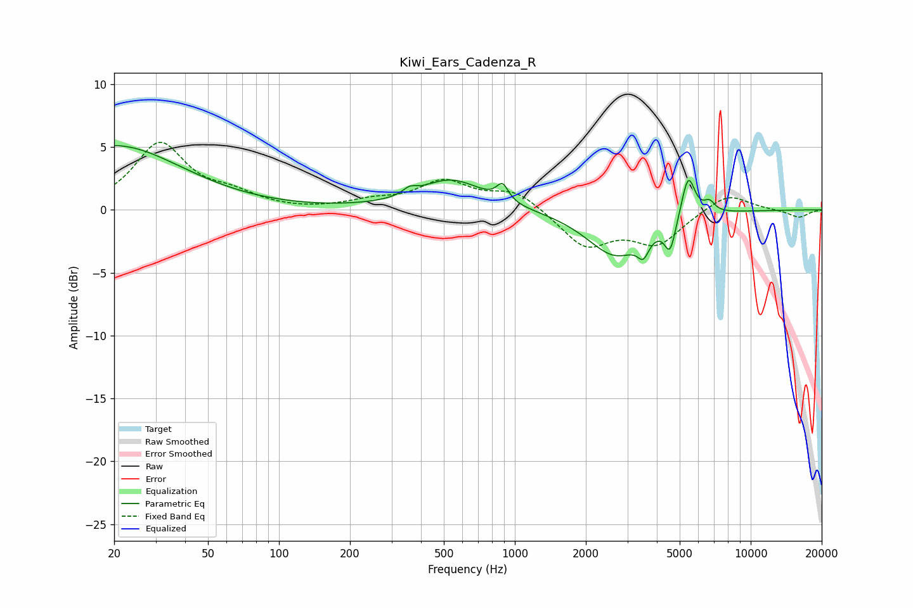

# Kiwi_Ears_Cadenza_R
See [usage instructions](https://github.com/jaakkopasanen/AutoEq#usage) for more options and info.

### Parametric EQs
Apply preamp of -5.2 dB when using parametric equalizer.

|   # | Type    |   Fc (Hz) |    Q |   Gain (dB) |
|-----|---------|-----------|------|-------------|
|   1 | Peaking |        20 | 0.5  |         5.1 |
|   2 | Peaking |       358 | 5.23 |         0.5 |
|   3 | Peaking |       537 | 1.04 |         2.4 |
|   4 | Peaking |       887 | 5.75 |         1.3 |
|   5 | Peaking |      2677 | 1.16 |        -3.6 |
|   6 | Peaking |      3505 | 5.84 |        -1.4 |
|   7 | Peaking |      4554 | 6    |        -2.5 |
|   8 | Peaking |      4773 | 2.41 |        -0.1 |
|   9 | Peaking |      5433 | 4.9  |         3.5 |
|  10 | Peaking |      6681 | 5.88 |         0.8 |

### Fixed Band EQs
When using fixed band (also called graphic) equalizer, apply preamp of **-5.5 dB** (if available) and set gains manually with these parameters.

|   # | Type    |   Fc (Hz) |    Q |   Gain (dB) |
|-----|---------|-----------|------|-------------|
|   1 | Peaking |        31 | 1.41 |         5.2 |
|   2 | Peaking |        62 | 1.41 |         1   |
|   3 | Peaking |       125 | 1.41 |        -0.1 |
|   4 | Peaking |       250 | 1.41 |         0.6 |
|   5 | Peaking |       500 | 1.41 |         2.1 |
|   6 | Peaking |      1000 | 1.41 |         1.5 |
|   7 | Peaking |      2000 | 1.41 |        -2.9 |
|   8 | Peaking |      4000 | 1.41 |        -2.6 |
|   9 | Peaking |      8000 | 1.41 |         1.4 |
|  10 | Peaking |     16000 | 1.41 |        -0.6 |

### Graphs

