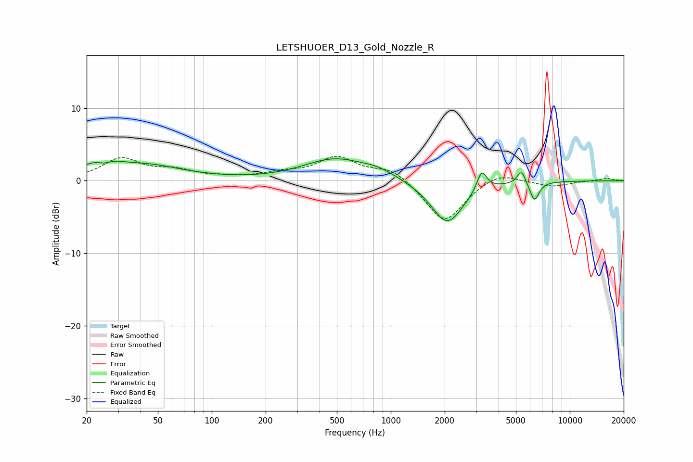

# LETSHUOER_D13_Gold_Nozzle_R
See [usage instructions](https://github.com/jaakkopasanen/AutoEq#usage) for more options and info.

### Parametric EQs
Apply preamp of -3.1 dB when using parametric equalizer.

|   # | Type    |   Fc (Hz) |    Q |   Gain (dB) |
|-----|---------|-----------|------|-------------|
|   1 | Peaking |        24 | 1.39 |         2.5 |
|   2 | Peaking |        25 | 3.39 |        -0.9 |
|   3 | Peaking |        46 | 0.8  |         1.7 |
|   4 | Peaking |        92 | 1.02 |         0.2 |
|   5 | Peaking |       486 | 0.8  |         2.9 |
|   6 | Peaking |       855 | 1.48 |         0.9 |
|   7 | Peaking |      2066 | 1.56 |        -6   |
|   8 | Peaking |      3224 | 5.2  |         2.8 |
|   9 | Peaking |      5371 | 6    |         1.9 |
|  10 | Peaking |      6346 | 5.45 |        -2.6 |

### Fixed Band EQs
When using fixed band (also called graphic) equalizer, apply preamp of **-3.5 dB** (if available) and set gains manually with these parameters.

|   # | Type    |   Fc (Hz) |    Q |   Gain (dB) |
|-----|---------|-----------|------|-------------|
|   1 | Peaking |        31 | 1.41 |         2.9 |
|   2 | Peaking |        62 | 1.41 |         1.2 |
|   3 | Peaking |       125 | 1.41 |         0.3 |
|   4 | Peaking |       250 | 1.41 |         0.9 |
|   5 | Peaking |       500 | 1.41 |         3.1 |
|   6 | Peaking |      1000 | 1.41 |         1.7 |
|   7 | Peaking |      2000 | 1.41 |        -5.8 |
|   8 | Peaking |      4000 | 1.41 |         1.4 |
|   9 | Peaking |      8000 | 1.41 |        -0.8 |
|  10 | Peaking |     16000 | 1.41 |         0.3 |

### Graphs

