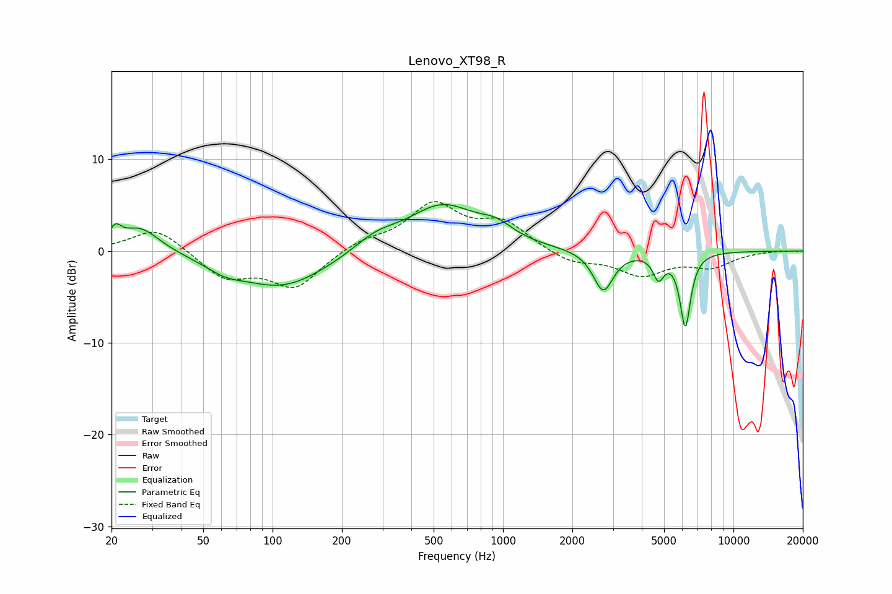

# Lenovo_XT98_R
See [usage instructions](https://github.com/jaakkopasanen/AutoEq#usage) for more options and info.

### Parametric EQs
Apply preamp of -5.2 dB when using parametric equalizer.

|   # | Type    |   Fc (Hz) |    Q |   Gain (dB) |
|-----|---------|-----------|------|-------------|
|   1 | Peaking |        21 | 5.87 |         1.6 |
|   2 | Peaking |        27 | 1.65 |         2.8 |
|   3 | Peaking |        62 | 1.8  |        -1   |
|   4 | Peaking |       110 | 0.72 |        -4   |
|   5 | Peaking |       280 | 1.5  |         1.5 |
|   6 | Peaking |       544 | 0.92 |         4.9 |
|   7 | Peaking |       936 | 1.93 |         1.4 |
|   8 | Peaking |      2724 | 3.26 |        -4.4 |
|   9 | Peaking |      4731 | 5.97 |        -2.5 |
|  10 | Peaking |      6182 | 5.99 |        -8   |

### Fixed Band EQs
When using fixed band (also called graphic) equalizer, apply preamp of **-5.5 dB** (if available) and set gains manually with these parameters.

|   # | Type    |   Fc (Hz) |    Q |   Gain (dB) |
|-----|---------|-----------|------|-------------|
|   1 | Peaking |        31 | 1.41 |         2.6 |
|   2 | Peaking |        62 | 1.41 |        -2.9 |
|   3 | Peaking |       125 | 1.41 |        -3.9 |
|   4 | Peaking |       250 | 1.41 |         1.1 |
|   5 | Peaking |       500 | 1.41 |         4.9 |
|   6 | Peaking |      1000 | 1.41 |         2.9 |
|   7 | Peaking |      2000 | 1.41 |        -1.3 |
|   8 | Peaking |      4000 | 1.41 |        -2.5 |
|   9 | Peaking |      8000 | 1.41 |        -1.6 |
|  10 | Peaking |     16000 | 1.41 |         0.1 |

### Graphs

