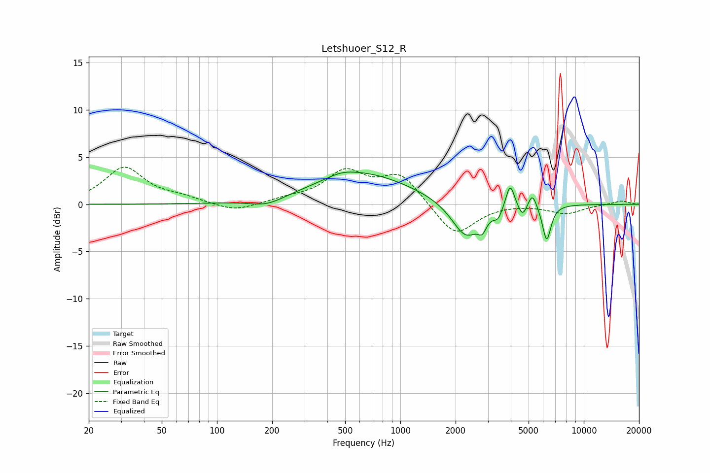

# Letshuoer_S12_R
See [usage instructions](https://github.com/jaakkopasanen/AutoEq#usage) for more options and info.

### Parametric EQs
Apply preamp of -3.5 dB when using parametric equalizer.

|   # | Type    |   Fc (Hz) |    Q |   Gain (dB) |
|-----|---------|-----------|------|-------------|
|   1 | Peaking |       187 | 1.54 |        -0.8 |
|   2 | Peaking |       477 | 1.78 |         0.5 |
|   3 | Peaking |       626 | 0.53 |         3.2 |
|   4 | Peaking |      2274 | 1.83 |        -3.8 |
|   5 | Peaking |      2796 | 6    |        -1.3 |
|   6 | Peaking |      3409 | 6    |        -1.1 |
|   7 | Peaking |      3968 | 5.97 |         2.7 |
|   8 | Peaking |      4637 | 6    |        -1.3 |
|   9 | Peaking |      5245 | 6    |         1.6 |
|  10 | Peaking |      6279 | 5.93 |        -3.8 |

### Fixed Band EQs
When using fixed band (also called graphic) equalizer, apply preamp of **-4.0 dB** (if available) and set gains manually with these parameters.

|   # | Type    |   Fc (Hz) |    Q |   Gain (dB) |
|-----|---------|-----------|------|-------------|
|   1 | Peaking |        31 | 1.41 |         3.8 |
|   2 | Peaking |        62 | 1.41 |         0.6 |
|   3 | Peaking |       125 | 1.41 |        -0.8 |
|   4 | Peaking |       250 | 1.41 |         0.5 |
|   5 | Peaking |       500 | 1.41 |         3.3 |
|   6 | Peaking |      1000 | 1.41 |         3.1 |
|   7 | Peaking |      2000 | 1.41 |        -3.5 |
|   8 | Peaking |      4000 | 1.41 |         0.1 |
|   9 | Peaking |      8000 | 1.41 |        -1   |
|  10 | Peaking |     16000 | 1.41 |         0.4 |

### Graphs

