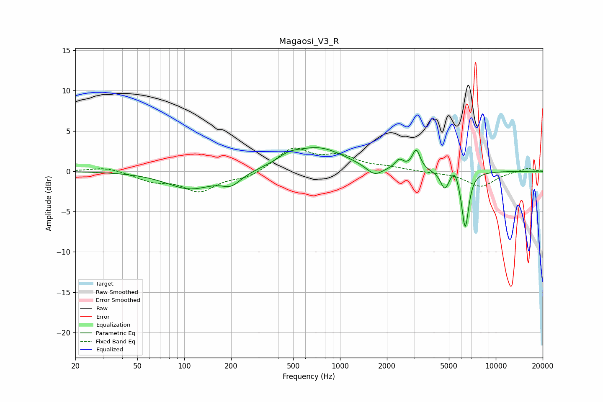

# Magaosi_V3_R
See [usage instructions](https://github.com/jaakkopasanen/AutoEq#usage) for more options and info.

### Parametric EQs
Apply preamp of -3.0 dB when using parametric equalizer.

|   # | Type    |   Fc (Hz) |    Q |   Gain (dB) |
|-----|---------|-----------|------|-------------|
|   1 | Peaking |       109 | 0.94 |        -2.2 |
|   2 | Peaking |       200 | 2.27 |        -1.4 |
|   3 | Peaking |       466 | 2.02 |         0.8 |
|   4 | Peaking |       726 | 0.81 |         2.8 |
|   5 | Peaking |      1664 | 2.75 |        -1.2 |
|   6 | Peaking |      2401 | 5.22 |         1.1 |
|   7 | Peaking |      3084 | 5.64 |         2.5 |
|   8 | Peaking |      4701 | 5.3  |        -2.1 |
|   9 | Peaking |      5432 | 5.99 |         1.2 |
|  10 | Peaking |      6363 | 6    |        -7   |

### Fixed Band EQs
When using fixed band (also called graphic) equalizer, apply preamp of **-3.0 dB** (if available) and set gains manually with these parameters.

|   # | Type    |   Fc (Hz) |    Q |   Gain (dB) |
|-----|---------|-----------|------|-------------|
|   1 | Peaking |        31 | 1.41 |         0.6 |
|   2 | Peaking |        62 | 1.41 |        -1.1 |
|   3 | Peaking |       125 | 1.41 |        -2.4 |
|   4 | Peaking |       250 | 1.41 |        -0.8 |
|   5 | Peaking |       500 | 1.41 |         2.8 |
|   6 | Peaking |      1000 | 1.41 |         1.7 |
|   7 | Peaking |      2000 | 1.41 |         0.4 |
|   8 | Peaking |      4000 | 1.41 |        -0.1 |
|   9 | Peaking |      8000 | 1.41 |        -1.9 |
|  10 | Peaking |     16000 | 1.41 |         0.4 |

### Graphs

