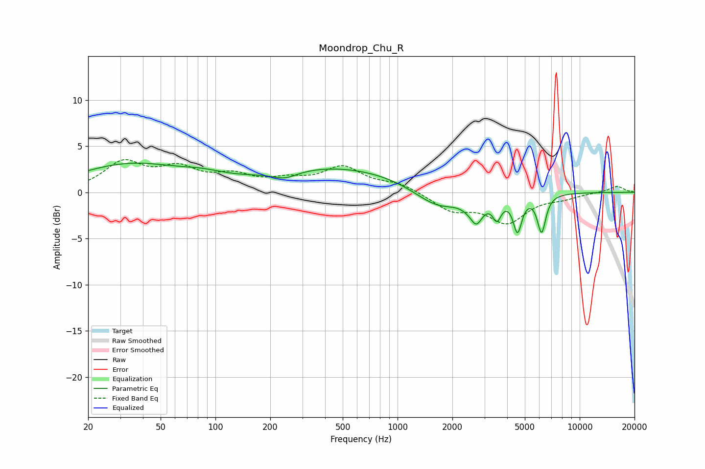

# Moondrop_Chu_R
See [usage instructions](https://github.com/jaakkopasanen/AutoEq#usage) for more options and info.

### Parametric EQs
Apply preamp of -3.3 dB when using parametric equalizer.

|   # | Type    |   Fc (Hz) |    Q |   Gain (dB) |
|-----|---------|-----------|------|-------------|
|   1 | Peaking |        34 | 0.48 |         3   |
|   2 | Peaking |        85 | 1.17 |         0.6 |
|   3 | Peaking |       241 | 2.07 |        -0.8 |
|   4 | Peaking |       475 | 0.36 |         2.7 |
|   5 | Peaking |      1658 | 1.07 |        -2.3 |
|   6 | Peaking |      2599 | 4.99 |         1.4 |
|   7 | Peaking |      2655 | 3.88 |        -4   |
|   8 | Peaking |      3515 | 6    |        -2.1 |
|   9 | Peaking |      4558 | 5.95 |        -3.8 |
|  10 | Peaking |      6178 | 6    |        -4   |

### Fixed Band EQs
When using fixed band (also called graphic) equalizer, apply preamp of **-3.6 dB** (if available) and set gains manually with these parameters.

|   # | Type    |   Fc (Hz) |    Q |   Gain (dB) |
|-----|---------|-----------|------|-------------|
|   1 | Peaking |        31 | 1.41 |         3   |
|   2 | Peaking |        62 | 1.41 |         2.2 |
|   3 | Peaking |       125 | 1.41 |         1.5 |
|   4 | Peaking |       250 | 1.41 |         1   |
|   5 | Peaking |       500 | 1.41 |         2.5 |
|   6 | Peaking |      1000 | 1.41 |         0.9 |
|   7 | Peaking |      2000 | 1.41 |        -1.8 |
|   8 | Peaking |      4000 | 1.41 |        -3.1 |
|   9 | Peaking |      8000 | 1.41 |        -0.5 |
|  10 | Peaking |     16000 | 1.41 |         0.7 |

### Graphs

