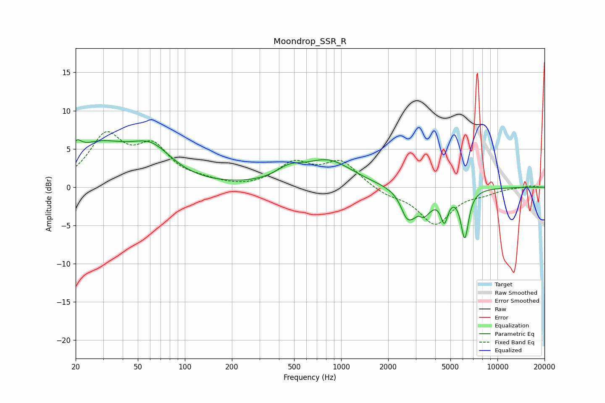

# Moondrop_SSR_R
See [usage instructions](https://github.com/jaakkopasanen/AutoEq#usage) for more options and info.

### Parametric EQs
Apply preamp of -6.3 dB when using parametric equalizer.

|   # | Type    |   Fc (Hz) |    Q |   Gain (dB) |
|-----|---------|-----------|------|-------------|
|   1 | Peaking |        20 | 4.64 |         1.6 |
|   2 | Peaking |        28 | 0.73 |         5   |
|   3 | Peaking |        61 | 1.05 |         3.9 |
|   4 | Peaking |       464 | 1.64 |         1.5 |
|   5 | Peaking |       827 | 0.91 |         3.3 |
|   6 | Peaking |      2624 | 3.89 |        -2.3 |
|   7 | Peaking |      3126 | 5.94 |         1.2 |
|   8 | Peaking |      3195 | 2.29 |        -4.4 |
|   9 | Peaking |      4574 | 6    |        -3.3 |
|  10 | Peaking |      6177 | 5.46 |        -6.2 |

### Fixed Band EQs
When using fixed band (also called graphic) equalizer, apply preamp of **-7.4 dB** (if available) and set gains manually with these parameters.

|   # | Type    |   Fc (Hz) |    Q |   Gain (dB) |
|-----|---------|-----------|------|-------------|
|   1 | Peaking |        31 | 1.41 |         6.3 |
|   2 | Peaking |        62 | 1.41 |         4.7 |
|   3 | Peaking |       125 | 1.41 |         0.6 |
|   4 | Peaking |       250 | 1.41 |        -0.2 |
|   5 | Peaking |       500 | 1.41 |         2.9 |
|   6 | Peaking |      1000 | 1.41 |         3.2 |
|   7 | Peaking |      2000 | 1.41 |        -0.9 |
|   8 | Peaking |      4000 | 1.41 |        -4.7 |
|   9 | Peaking |      8000 | 1.41 |        -0.6 |
|  10 | Peaking |     16000 | 1.41 |         0.2 |

### Graphs

