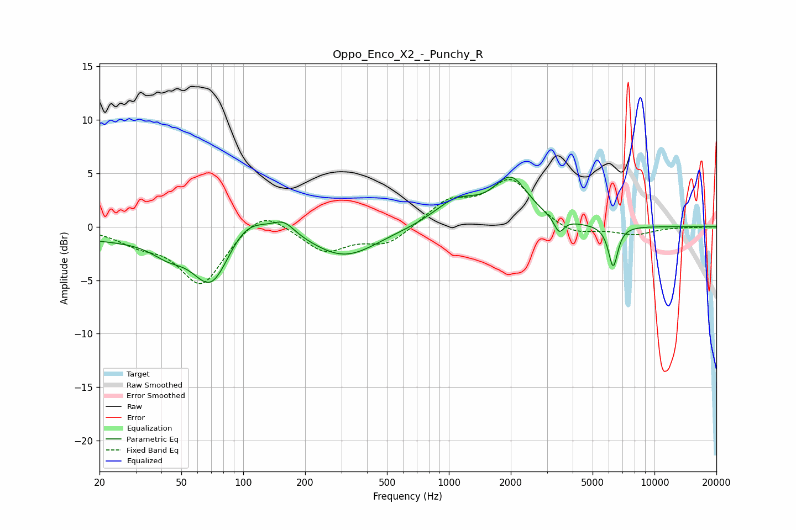

# Oppo_Enco_X2_-_Punchy_R
See [usage instructions](https://github.com/jaakkopasanen/AutoEq#usage) for more options and info.

### Parametric EQs
Apply preamp of -4.7 dB when using parametric equalizer.

|   # | Type    |   Fc (Hz) |    Q |   Gain (dB) |
|-----|---------|-----------|------|-------------|
|   1 | Peaking |        21 | 0.44 |        -1   |
|   2 | Peaking |        43 | 1.73 |        -1.3 |
|   3 | Peaking |        70 | 1.54 |        -5.4 |
|   4 | Peaking |       103 | 1.38 |         2.3 |
|   5 | Peaking |       158 | 2.59 |         1.2 |
|   6 | Peaking |       312 | 0.88 |        -2.8 |
|   7 | Peaking |      1085 | 1.29 |         2.3 |
|   8 | Peaking |      2007 | 1.67 |         4.2 |
|   9 | Peaking |      3436 | 6    |        -1.4 |
|  10 | Peaking |      6294 | 6    |        -3.8 |

### Fixed Band EQs
When using fixed band (also called graphic) equalizer, apply preamp of **-4.5 dB** (if available) and set gains manually with these parameters.

|   # | Type    |   Fc (Hz) |    Q |   Gain (dB) |
|-----|---------|-----------|------|-------------|
|   1 | Peaking |        31 | 1.41 |        -1.2 |
|   2 | Peaking |        62 | 1.41 |        -5.4 |
|   3 | Peaking |       125 | 1.41 |         2   |
|   4 | Peaking |       250 | 1.41 |        -2.3 |
|   5 | Peaking |       500 | 1.41 |        -1.6 |
|   6 | Peaking |      1000 | 1.41 |         2.2 |
|   7 | Peaking |      2000 | 1.41 |         4.3 |
|   8 | Peaking |      4000 | 1.41 |        -1   |
|   9 | Peaking |      8000 | 1.41 |        -0.7 |
|  10 | Peaking |     16000 | 1.41 |        -0   |

### Graphs

