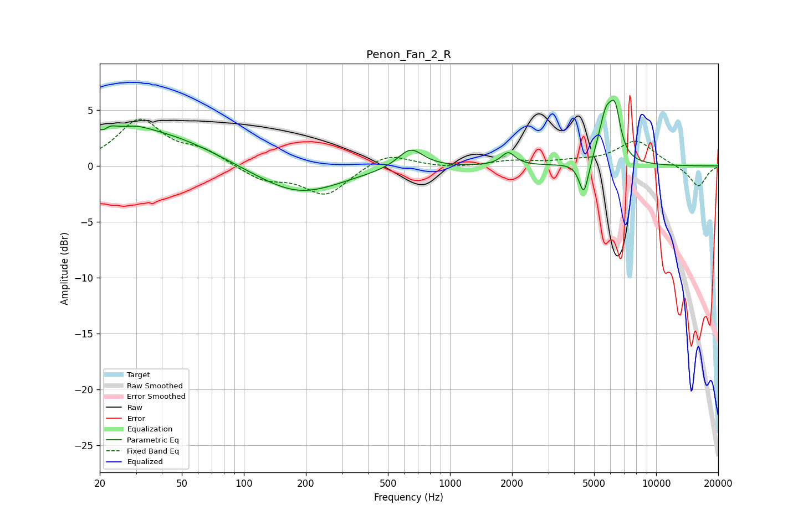

# Penon_Fan_2_R
See [usage instructions](https://github.com/jaakkopasanen/AutoEq#usage) for more options and info.

### Parametric EQs
Apply preamp of -6.0 dB when using parametric equalizer.

|   # | Type    |   Fc (Hz) |    Q |   Gain (dB) |
|-----|---------|-----------|------|-------------|
|   1 | Peaking |        20 | 3.07 |         3.4 |
|   2 | Peaking |        21 | 4.95 |        -2.1 |
|   3 | Peaking |        29 | 1.7  |         0.8 |
|   4 | Peaking |        40 | 0.56 |         2.7 |
|   5 | Peaking |       184 | 0.69 |        -2.6 |
|   6 | Peaking |       643 | 2.3  |         1.8 |
|   7 | Peaking |      1917 | 4.25 |         1.2 |
|   8 | Peaking |      4464 | 6    |        -3.1 |
|   9 | Peaking |      5712 | 3.84 |         4.2 |
|  10 | Peaking |      6335 | 5.44 |         3.5 |

### Fixed Band EQs
When using fixed band (also called graphic) equalizer, apply preamp of **-4.3 dB** (if available) and set gains manually with these parameters.

|   # | Type    |   Fc (Hz) |    Q |   Gain (dB) |
|-----|---------|-----------|------|-------------|
|   1 | Peaking |        31 | 1.41 |         4   |
|   2 | Peaking |        62 | 1.41 |         1.2 |
|   3 | Peaking |       125 | 1.41 |        -1.2 |
|   4 | Peaking |       250 | 1.41 |        -2.6 |
|   5 | Peaking |       500 | 1.41 |         1.2 |
|   6 | Peaking |      1000 | 1.41 |        -0.2 |
|   7 | Peaking |      2000 | 1.41 |         0.4 |
|   8 | Peaking |      4000 | 1.41 |         0.3 |
|   9 | Peaking |      8000 | 1.41 |         2.2 |
|  10 | Peaking |     16000 | 1.41 |        -1.9 |

### Graphs

