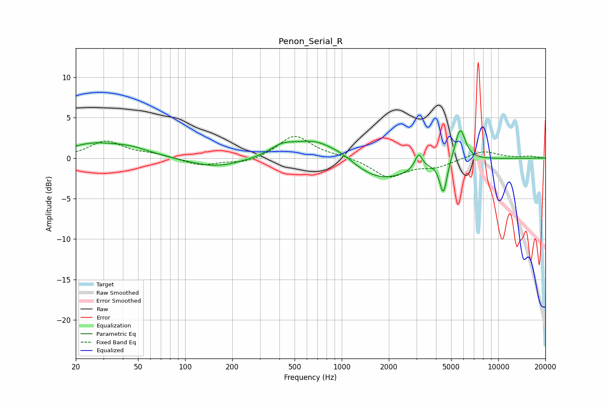

# Penon_Serial_R
See [usage instructions](https://github.com/jaakkopasanen/AutoEq#usage) for more options and info.

### Parametric EQs
Apply preamp of -3.5 dB when using parametric equalizer.

|   # | Type    |   Fc (Hz) |    Q |   Gain (dB) |
|-----|---------|-----------|------|-------------|
|   1 | Peaking |        25 | 0.94 |         1.4 |
|   2 | Peaking |        44 | 0.99 |         1.1 |
|   3 | Peaking |       157 | 0.82 |        -1.2 |
|   4 | Peaking |       417 | 1.82 |         1.1 |
|   5 | Peaking |       686 | 0.93 |         2.5 |
|   6 | Peaking |      1025 | 2.01 |         0.4 |
|   7 | Peaking |      1777 | 0.74 |        -2.9 |
|   8 | Peaking |      3100 | 6    |         1.9 |
|   9 | Peaking |      4461 | 6    |        -4.2 |
|  10 | Peaking |      5708 | 4.14 |         4.1 |

### Fixed Band EQs
When using fixed band (also called graphic) equalizer, apply preamp of **-2.8 dB** (if available) and set gains manually with these parameters.

|   # | Type    |   Fc (Hz) |    Q |   Gain (dB) |
|-----|---------|-----------|------|-------------|
|   1 | Peaking |        31 | 1.41 |         2.1 |
|   2 | Peaking |        62 | 1.41 |         0.4 |
|   3 | Peaking |       125 | 1.41 |        -0.9 |
|   4 | Peaking |       250 | 1.41 |        -0.7 |
|   5 | Peaking |       500 | 1.41 |         2.9 |
|   6 | Peaking |      1000 | 1.41 |         0.2 |
|   7 | Peaking |      2000 | 1.41 |        -2.3 |
|   8 | Peaking |      4000 | 1.41 |        -1   |
|   9 | Peaking |      8000 | 1.41 |         0.9 |
|  10 | Peaking |     16000 | 1.41 |         0.2 |

### Graphs

