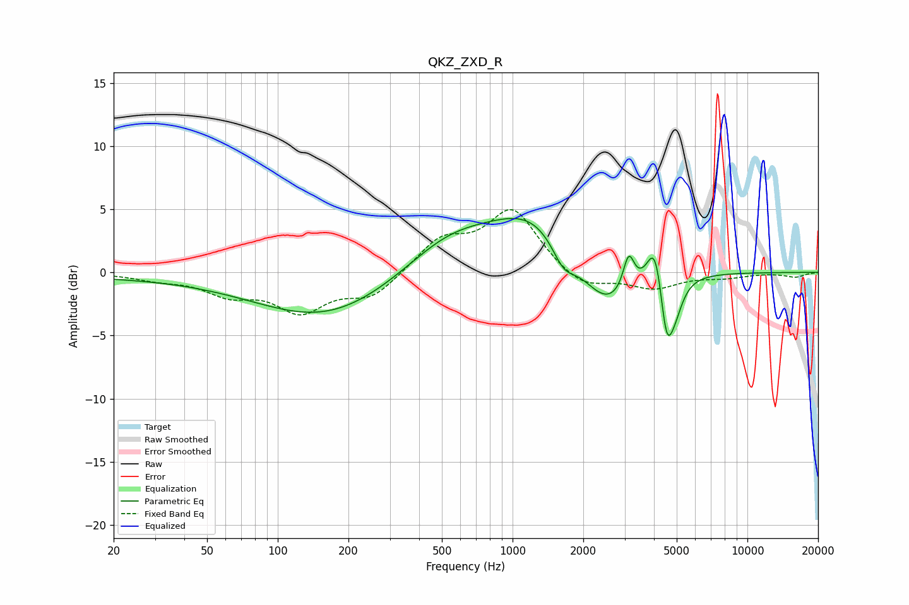

# QKZ_ZXD_R
See [usage instructions](https://github.com/jaakkopasanen/AutoEq#usage) for more options and info.

### Parametric EQs
Apply preamp of -4.4 dB when using parametric equalizer.

|   # | Type    |   Fc (Hz) |    Q |   Gain (dB) |
|-----|---------|-----------|------|-------------|
|   1 | Peaking |        44 | 0.18 |        -0.4 |
|   2 | Peaking |       162 | 0.49 |        -3.4 |
|   3 | Peaking |       537 | 0.73 |         2.7 |
|   4 | Peaking |      1249 | 0.74 |         4.4 |
|   5 | Peaking |      1647 | 2.74 |        -2   |
|   6 | Peaking |      2517 | 1.21 |        -3.9 |
|   7 | Peaking |      3122 | 6    |         2.8 |
|   8 | Peaking |      4047 | 4.23 |         3.8 |
|   9 | Peaking |      4525 | 5.22 |        -4.7 |
|  10 | Peaking |      4906 | 3.9  |        -2.3 |

### Fixed Band EQs
When using fixed band (also called graphic) equalizer, apply preamp of **-5.1 dB** (if available) and set gains manually with these parameters.

|   # | Type    |   Fc (Hz) |    Q |   Gain (dB) |
|-----|---------|-----------|------|-------------|
|   1 | Peaking |        31 | 1.41 |        -0.5 |
|   2 | Peaking |        62 | 1.41 |        -1.5 |
|   3 | Peaking |       125 | 1.41 |        -2.9 |
|   4 | Peaking |       250 | 1.41 |        -1.9 |
|   5 | Peaking |       500 | 1.41 |         2.5 |
|   6 | Peaking |      1000 | 1.41 |         4.9 |
|   7 | Peaking |      2000 | 1.41 |        -1.4 |
|   8 | Peaking |      4000 | 1.41 |        -1.2 |
|   9 | Peaking |      8000 | 1.41 |        -0.3 |
|  10 | Peaking |     16000 | 1.41 |        -0.4 |

### Graphs

