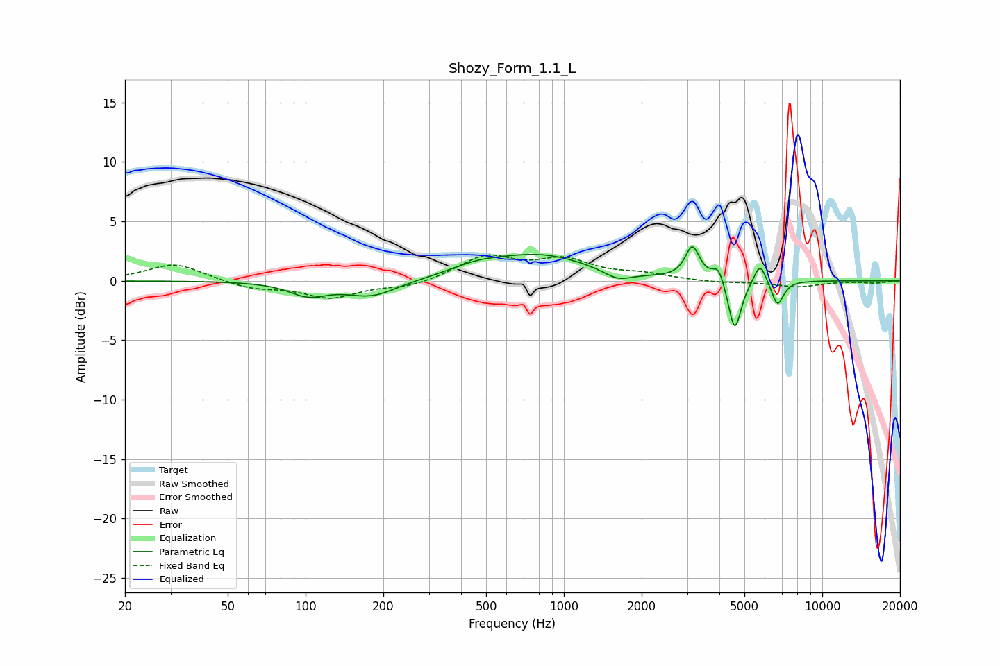

# Shozy_Form_1.1_L
See [usage instructions](https://github.com/jaakkopasanen/AutoEq#usage) for more options and info.

### Parametric EQs
Apply preamp of -3.0 dB when using parametric equalizer.

|   # | Type    |   Fc (Hz) |    Q |   Gain (dB) |
|-----|---------|-----------|------|-------------|
|   1 | Peaking |       102 | 1.94 |        -1.1 |
|   2 | Peaking |       180 | 1.4  |        -1.3 |
|   3 | Peaking |       460 | 1.39 |         0.7 |
|   4 | Peaking |       808 | 0.73 |         2.1 |
|   5 | Peaking |      1617 | 2.62 |        -0.8 |
|   6 | Peaking |      3144 | 5.16 |         2.7 |
|   7 | Peaking |      3970 | 6    |         1.4 |
|   8 | Peaking |      4583 | 5.69 |        -4.5 |
|   9 | Peaking |      5750 | 6    |         1.8 |
|  10 | Peaking |      6714 | 5.94 |        -2.1 |

### Fixed Band EQs
When using fixed band (also called graphic) equalizer, apply preamp of **-2.3 dB** (if available) and set gains manually with these parameters.

|   # | Type    |   Fc (Hz) |    Q |   Gain (dB) |
|-----|---------|-----------|------|-------------|
|   1 | Peaking |        31 | 1.41 |         1.5 |
|   2 | Peaking |        62 | 1.41 |        -0.6 |
|   3 | Peaking |       125 | 1.41 |        -1.4 |
|   4 | Peaking |       250 | 1.41 |        -0.5 |
|   5 | Peaking |       500 | 1.41 |         2   |
|   6 | Peaking |      1000 | 1.41 |         1.6 |
|   7 | Peaking |      2000 | 1.41 |         0.5 |
|   8 | Peaking |      4000 | 1.41 |        -0.2 |
|   9 | Peaking |      8000 | 1.41 |        -0.5 |
|  10 | Peaking |     16000 | 1.41 |        -0.2 |

### Graphs

