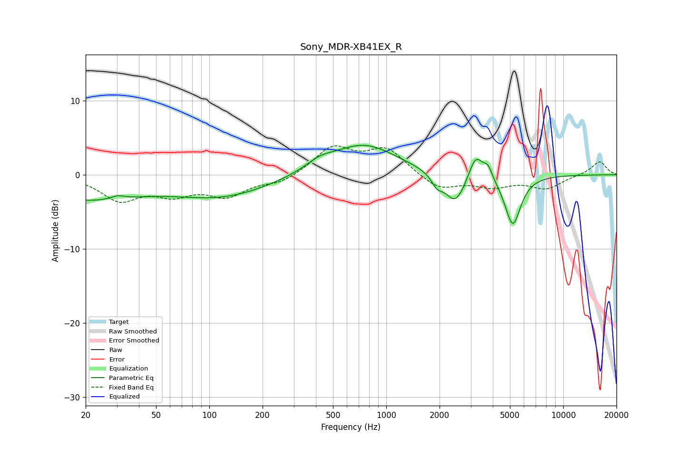

# Sony_MDR-XB41EX_R
See [usage instructions](https://github.com/jaakkopasanen/AutoEq#usage) for more options and info.

### Parametric EQs
Apply preamp of -4.1 dB when using parametric equalizer.

|   # | Type    |   Fc (Hz) |    Q |   Gain (dB) |
|-----|---------|-----------|------|-------------|
|   1 | Peaking |        20 | 0.48 |        -3.2 |
|   2 | Peaking |        30 | 3.72 |         0.5 |
|   3 | Peaking |       118 | 0.51 |        -2.8 |
|   4 | Peaking |       420 | 1.8  |         1.1 |
|   5 | Peaking |       743 | 0.76 |         4.1 |
|   6 | Peaking |      1934 | 4.7  |        -1.3 |
|   7 | Peaking |      2460 | 2.35 |        -4.2 |
|   8 | Peaking |      3206 | 3.41 |         3.6 |
|   9 | Peaking |      3765 | 6    |         1.5 |
|  10 | Peaking |      5188 | 3.12 |        -6.8 |

### Fixed Band EQs
When using fixed band (also called graphic) equalizer, apply preamp of **-4.0 dB** (if available) and set gains manually with these parameters.

|   # | Type    |   Fc (Hz) |    Q |   Gain (dB) |
|-----|---------|-----------|------|-------------|
|   1 | Peaking |        31 | 1.41 |        -3.2 |
|   2 | Peaking |        62 | 1.41 |        -2.2 |
|   3 | Peaking |       125 | 1.41 |        -2.6 |
|   4 | Peaking |       250 | 1.41 |        -1.1 |
|   5 | Peaking |       500 | 1.41 |         3.6 |
|   6 | Peaking |      1000 | 1.41 |         3.4 |
|   7 | Peaking |      2000 | 1.41 |        -2   |
|   8 | Peaking |      4000 | 1.41 |        -1.4 |
|   9 | Peaking |      8000 | 1.41 |        -1.8 |
|  10 | Peaking |     16000 | 1.41 |         1.9 |

### Graphs

