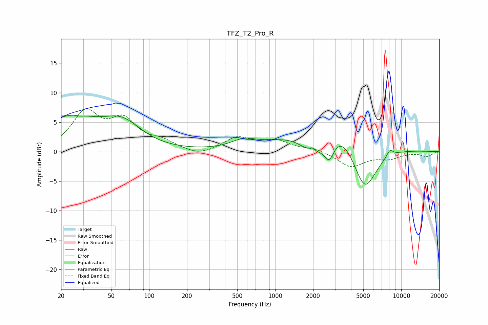

# TFZ_T2_Pro_R
See [usage instructions](https://github.com/jaakkopasanen/AutoEq#usage) for more options and info.

### Parametric EQs
Apply preamp of -6.3 dB when using parametric equalizer.

|   # | Type    |   Fc (Hz) |    Q |   Gain (dB) |
|-----|---------|-----------|------|-------------|
|   1 | Peaking |        23 | 0.63 |         5.4 |
|   2 | Peaking |        28 | 5.08 |        -0.2 |
|   3 | Peaking |        61 | 0.92 |         4   |
|   4 | Peaking |       560 | 1.47 |         1.3 |
|   5 | Peaking |      1970 | 5.96 |         0.8 |
|   6 | Peaking |      2042 | 1.23 |        -6.1 |
|   7 | Peaking |      2687 | 3.37 |        -3.9 |
|   8 | Peaking |      2808 | 0.54 |         9.2 |
|   9 | Peaking |      5100 | 1.28 |       -10.5 |
|  10 | Peaking |      8116 | 5.03 |         1.2 |

### Fixed Band EQs
When using fixed band (also called graphic) equalizer, apply preamp of **-7.4 dB** (if available) and set gains manually with these parameters.

|   # | Type    |   Fc (Hz) |    Q |   Gain (dB) |
|-----|---------|-----------|------|-------------|
|   1 | Peaking |        31 | 1.41 |         6.3 |
|   2 | Peaking |        62 | 1.41 |         4.7 |
|   3 | Peaking |       125 | 1.41 |         1.4 |
|   4 | Peaking |       250 | 1.41 |        -0.9 |
|   5 | Peaking |       500 | 1.41 |         2.3 |
|   6 | Peaking |      1000 | 1.41 |         1.7 |
|   7 | Peaking |      2000 | 1.41 |         0.5 |
|   8 | Peaking |      4000 | 1.41 |        -2.6 |
|   9 | Peaking |      8000 | 1.41 |        -1   |
|  10 | Peaking |     16000 | 1.41 |        -0.8 |

### Graphs

