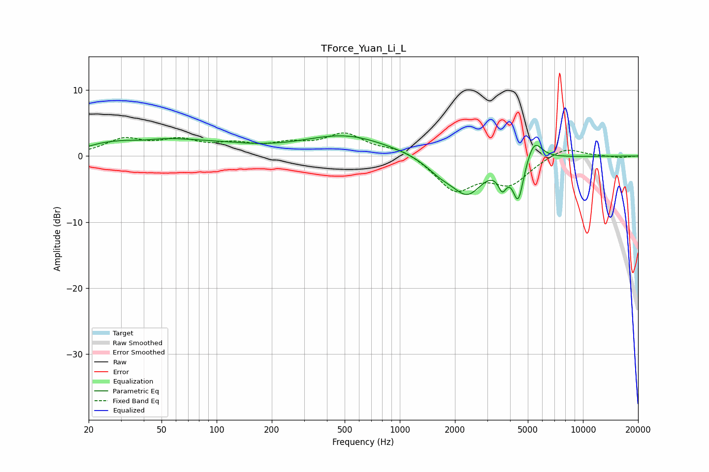

# TForce_Yuan_Li_L
See [usage instructions](https://github.com/jaakkopasanen/AutoEq#usage) for more options and info.

### Parametric EQs
Apply preamp of -3.2 dB when using parametric equalizer.

|   # | Type    |   Fc (Hz) |    Q |   Gain (dB) |
|-----|---------|-----------|------|-------------|
|   1 | Peaking |        20 | 4.97 |        -0.2 |
|   2 | Peaking |        39 | 1.73 |        -0.4 |
|   3 | Peaking |        40 | 0.47 |         2.6 |
|   4 | Peaking |       111 | 0.67 |         0.7 |
|   5 | Peaking |       504 | 0.6  |         3.1 |
|   6 | Peaking |      1662 | 1.71 |        -1.9 |
|   7 | Peaking |      2342 | 1.66 |        -5.3 |
|   8 | Peaking |      3629 | 6    |        -2.9 |
|   9 | Peaking |      4433 | 4.75 |        -6.3 |
|  10 | Peaking |      5411 | 3.32 |         3.3 |

### Fixed Band EQs
When using fixed band (also called graphic) equalizer, apply preamp of **-3.6 dB** (if available) and set gains manually with these parameters.

|   # | Type    |   Fc (Hz) |    Q |   Gain (dB) |
|-----|---------|-----------|------|-------------|
|   1 | Peaking |        31 | 1.41 |         2.3 |
|   2 | Peaking |        62 | 1.41 |         2   |
|   3 | Peaking |       125 | 1.41 |         1.4 |
|   4 | Peaking |       250 | 1.41 |         1.5 |
|   5 | Peaking |       500 | 1.41 |         3.1 |
|   6 | Peaking |      1000 | 1.41 |         1.2 |
|   7 | Peaking |      2000 | 1.41 |        -5.1 |
|   8 | Peaking |      4000 | 1.41 |        -3.9 |
|   9 | Peaking |      8000 | 1.41 |         1.5 |
|  10 | Peaking |     16000 | 1.41 |        -0.2 |

### Graphs

