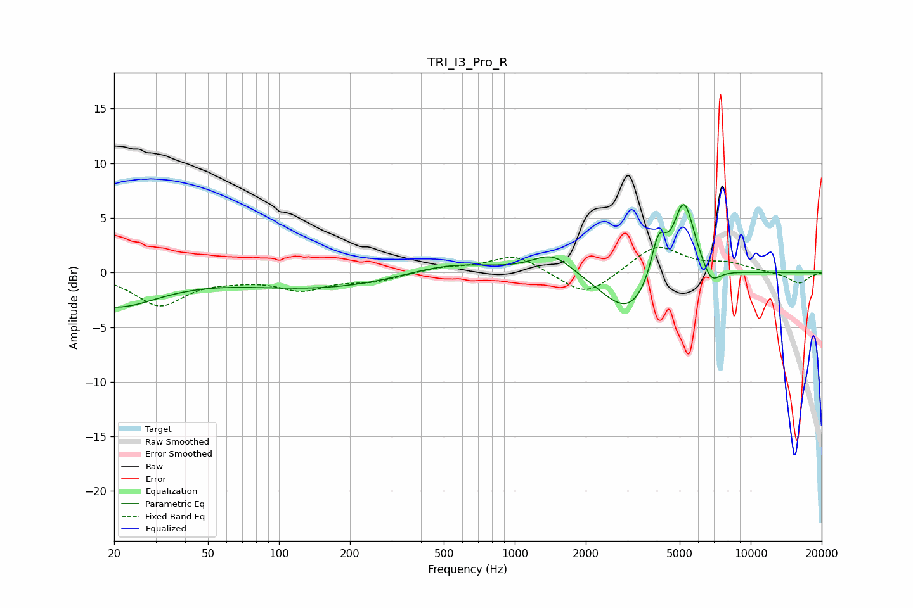

# TRI_I3_Pro_R
See [usage instructions](https://github.com/jaakkopasanen/AutoEq#usage) for more options and info.

### Parametric EQs
Apply preamp of -6.3 dB when using parametric equalizer.

|   # | Type    |   Fc (Hz) |    Q |   Gain (dB) |
|-----|---------|-----------|------|-------------|
|   1 | Peaking |        20 | 0.76 |        -3   |
|   2 | Peaking |       153 | 0.41 |        -1.4 |
|   3 | Peaking |       528 | 0.76 |         1.1 |
|   4 | Peaking |      1447 | 1.65 |         1.9 |
|   5 | Peaking |      3036 | 1.26 |        -4   |
|   6 | Peaking |      4058 | 4.39 |         3.9 |
|   7 | Peaking |      4335 | 5.8  |         0.1 |
|   8 | Peaking |      5068 | 4.2  |         0.9 |
|   9 | Peaking |      5245 | 2.97 |         6.2 |
|  10 | Peaking |      6792 | 3.63 |        -1.6 |

### Fixed Band EQs
When using fixed band (also called graphic) equalizer, apply preamp of **-2.4 dB** (if available) and set gains manually with these parameters.

|   # | Type    |   Fc (Hz) |    Q |   Gain (dB) |
|-----|---------|-----------|------|-------------|
|   1 | Peaking |        31 | 1.41 |        -2.9 |
|   2 | Peaking |        62 | 1.41 |        -0.4 |
|   3 | Peaking |       125 | 1.41 |        -1.4 |
|   4 | Peaking |       250 | 1.41 |        -0.7 |
|   5 | Peaking |       500 | 1.41 |         0.4 |
|   6 | Peaking |      1000 | 1.41 |         1.6 |
|   7 | Peaking |      2000 | 1.41 |        -2.3 |
|   8 | Peaking |      4000 | 1.41 |         2.5 |
|   9 | Peaking |      8000 | 1.41 |         0.7 |
|  10 | Peaking |     16000 | 1.41 |        -1   |

### Graphs

