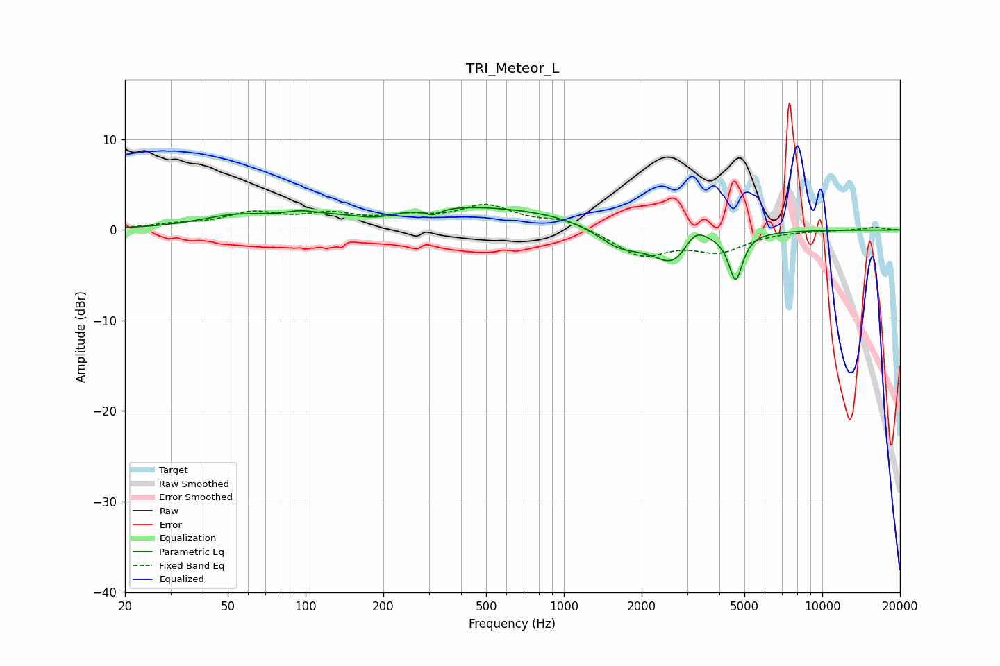

# TRI_Meteor_L
See [usage instructions](https://github.com/jaakkopasanen/AutoEq#usage) for more options and info.

### Parametric EQs
Apply preamp of -2.6 dB when using parametric equalizer.

|   # | Type    |   Fc (Hz) |    Q |   Gain (dB) |
|-----|---------|-----------|------|-------------|
|   1 | Peaking |        53 | 1.05 |         1.1 |
|   2 | Peaking |        96 | 2.46 |         0.5 |
|   3 | Peaking |       174 | 1.88 |        -0.3 |
|   4 | Peaking |       198 | 1.59 |        -0.7 |
|   5 | Peaking |       311 | 4.69 |        -0.7 |
|   6 | Peaking |       386 | 0.27 |         2.7 |
|   7 | Peaking |      1646 | 1.51 |        -2.3 |
|   8 | Peaking |      2717 | 1.66 |        -4.4 |
|   9 | Peaking |      3199 | 2.82 |         2.8 |
|  10 | Peaking |      4623 | 5.34 |        -5.1 |

### Fixed Band EQs
When using fixed band (also called graphic) equalizer, apply preamp of **-2.9 dB** (if available) and set gains manually with these parameters.

|   # | Type    |   Fc (Hz) |    Q |   Gain (dB) |
|-----|---------|-----------|------|-------------|
|   1 | Peaking |        31 | 1.41 |         0.5 |
|   2 | Peaking |        62 | 1.41 |         1.7 |
|   3 | Peaking |       125 | 1.41 |         1.4 |
|   4 | Peaking |       250 | 1.41 |         1.1 |
|   5 | Peaking |       500 | 1.41 |         2.5 |
|   6 | Peaking |      1000 | 1.41 |         1.1 |
|   7 | Peaking |      2000 | 1.41 |        -2.8 |
|   8 | Peaking |      4000 | 1.41 |        -2.1 |
|   9 | Peaking |      8000 | 1.41 |        -0   |
|  10 | Peaking |     16000 | 1.41 |         0.3 |

### Graphs

