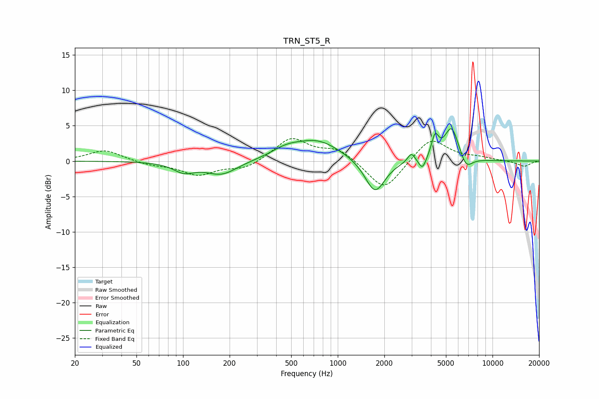

# TRN_ST5_R
See [usage instructions](https://github.com/jaakkopasanen/AutoEq#usage) for more options and info.

### Parametric EQs
Apply preamp of -4.6 dB when using parametric equalizer.

|   # | Type    |   Fc (Hz) |    Q |   Gain (dB) |
|-----|---------|-----------|------|-------------|
|   1 | Peaking |       102 | 2.07 |        -1.3 |
|   2 | Peaking |       178 | 1.38 |        -1.9 |
|   3 | Peaking |       462 | 1.48 |         1.1 |
|   4 | Peaking |       741 | 0.93 |         2.8 |
|   5 | Peaking |      1740 | 2.19 |        -4.8 |
|   6 | Peaking |      2988 | 5.94 |         1.3 |
|   7 | Peaking |      3527 | 5.93 |        -1.7 |
|   8 | Peaking |      4253 | 6    |         2.9 |
|   9 | Peaking |      5439 | 2.96 |         4.8 |
|  10 | Peaking |      6748 | 3.47 |        -1.9 |

### Fixed Band EQs
When using fixed band (also called graphic) equalizer, apply preamp of **-3.3 dB** (if available) and set gains manually with these parameters.

|   # | Type    |   Fc (Hz) |    Q |   Gain (dB) |
|-----|---------|-----------|------|-------------|
|   1 | Peaking |        31 | 1.41 |         1.6 |
|   2 | Peaking |        62 | 1.41 |        -0.5 |
|   3 | Peaking |       125 | 1.41 |        -1.9 |
|   4 | Peaking |       250 | 1.41 |        -1.1 |
|   5 | Peaking |       500 | 1.41 |         3.2 |
|   6 | Peaking |      1000 | 1.41 |         1.7 |
|   7 | Peaking |      2000 | 1.41 |        -4.4 |
|   8 | Peaking |      4000 | 1.41 |         3.4 |
|   9 | Peaking |      8000 | 1.41 |         0.4 |
|  10 | Peaking |     16000 | 1.41 |        -0.8 |

### Graphs

