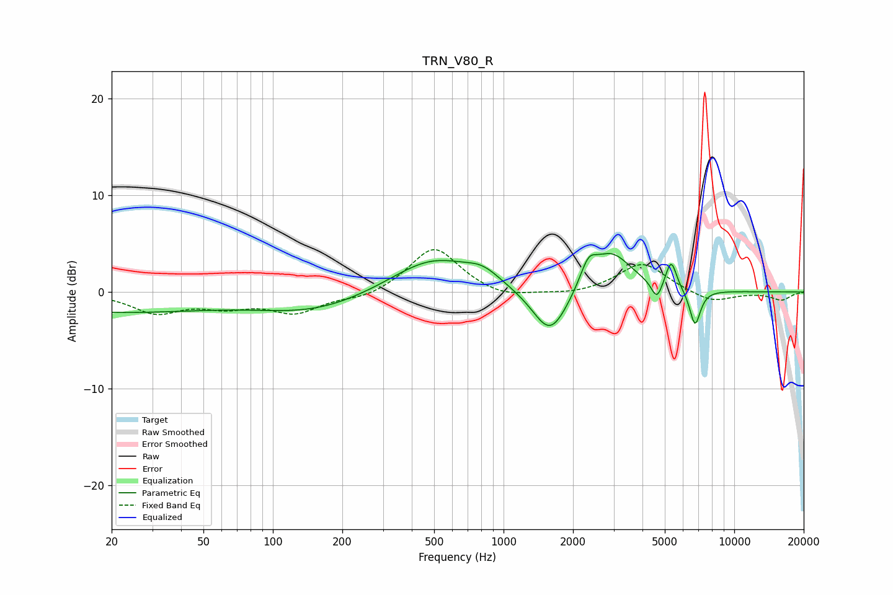

# TRN_V80_R
See [usage instructions](https://github.com/jaakkopasanen/AutoEq#usage) for more options and info.

### Parametric EQs
Apply preamp of -4.1 dB when using parametric equalizer.

|   # | Type    |   Fc (Hz) |    Q |   Gain (dB) |
|-----|---------|-----------|------|-------------|
|   1 | Peaking |        20 | 0.3  |        -2   |
|   2 | Peaking |       152 | 0.58 |        -1.9 |
|   3 | Peaking |       494 | 0.78 |         3.6 |
|   4 | Peaking |       814 | 1.96 |         1.2 |
|   5 | Peaking |      1595 | 1.81 |        -5.1 |
|   6 | Peaking |      2330 | 3.97 |         2.3 |
|   7 | Peaking |      2924 | 1.57 |         4.1 |
|   8 | Peaking |      4618 | 6    |        -1.9 |
|   9 | Peaking |      5325 | 5.94 |         3   |
|  10 | Peaking |      6761 | 5.83 |        -3.8 |

### Fixed Band EQs
When using fixed band (also called graphic) equalizer, apply preamp of **-4.5 dB** (if available) and set gains manually with these parameters.

|   # | Type    |   Fc (Hz) |    Q |   Gain (dB) |
|-----|---------|-----------|------|-------------|
|   1 | Peaking |        31 | 1.41 |        -2   |
|   2 | Peaking |        62 | 1.41 |        -1.3 |
|   3 | Peaking |       125 | 1.41 |        -2   |
|   4 | Peaking |       250 | 1.41 |        -0.7 |
|   5 | Peaking |       500 | 1.41 |         4.7 |
|   6 | Peaking |      1000 | 1.41 |        -0.8 |
|   7 | Peaking |      2000 | 1.41 |        -0.3 |
|   8 | Peaking |      4000 | 1.41 |         3   |
|   9 | Peaking |      8000 | 1.41 |        -1.1 |
|  10 | Peaking |     16000 | 1.41 |        -0.8 |

### Graphs

