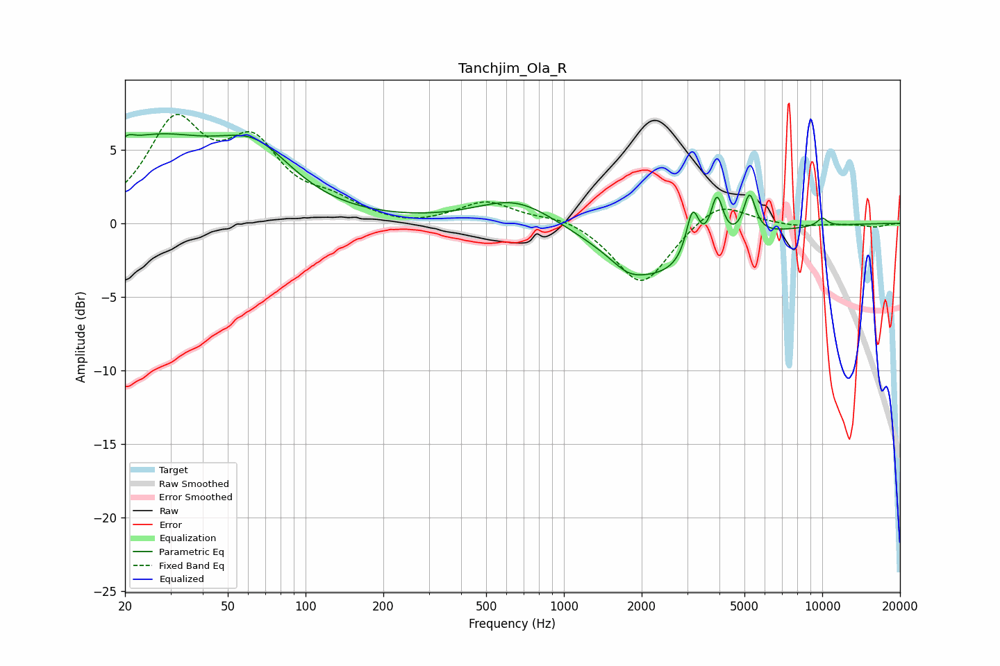

# Tanchjim_Ola_R
See [usage instructions](https://github.com/jaakkopasanen/AutoEq#usage) for more options and info.

### Parametric EQs
Apply preamp of -6.2 dB when using parametric equalizer.

|   # | Type    |   Fc (Hz) |    Q |   Gain (dB) |
|-----|---------|-----------|------|-------------|
|   1 | Peaking |        20 | 5.86 |         0.5 |
|   2 | Peaking |        25 | 0.53 |         5.3 |
|   3 | Peaking |        64 | 0.97 |         3.4 |
|   4 | Peaking |       654 | 0.92 |         1.8 |
|   5 | Peaking |      1775 | 2.32 |        -0.7 |
|   6 | Peaking |      2321 | 0.71 |        -3.5 |
|   7 | Peaking |      3148 | 5.78 |         3.2 |
|   8 | Peaking |      3912 | 5.79 |         3.3 |
|   9 | Peaking |      5232 | 6    |         2.9 |
|  10 | Peaking |     10000 | 5.99 |         0.6 |

### Fixed Band EQs
When using fixed band (also called graphic) equalizer, apply preamp of **-7.5 dB** (if available) and set gains manually with these parameters.

|   # | Type    |   Fc (Hz) |    Q |   Gain (dB) |
|-----|---------|-----------|------|-------------|
|   1 | Peaking |        31 | 1.41 |         6.4 |
|   2 | Peaking |        62 | 1.41 |         4.7 |
|   3 | Peaking |       125 | 1.41 |         1.1 |
|   4 | Peaking |       250 | 1.41 |        -0.3 |
|   5 | Peaking |       500 | 1.41 |         1.5 |
|   6 | Peaking |      1000 | 1.41 |         0.5 |
|   7 | Peaking |      2000 | 1.41 |        -4.3 |
|   8 | Peaking |      4000 | 1.41 |         1.7 |
|   9 | Peaking |      8000 | 1.41 |        -0.2 |
|  10 | Peaking |     16000 | 1.41 |        -0.2 |

### Graphs

