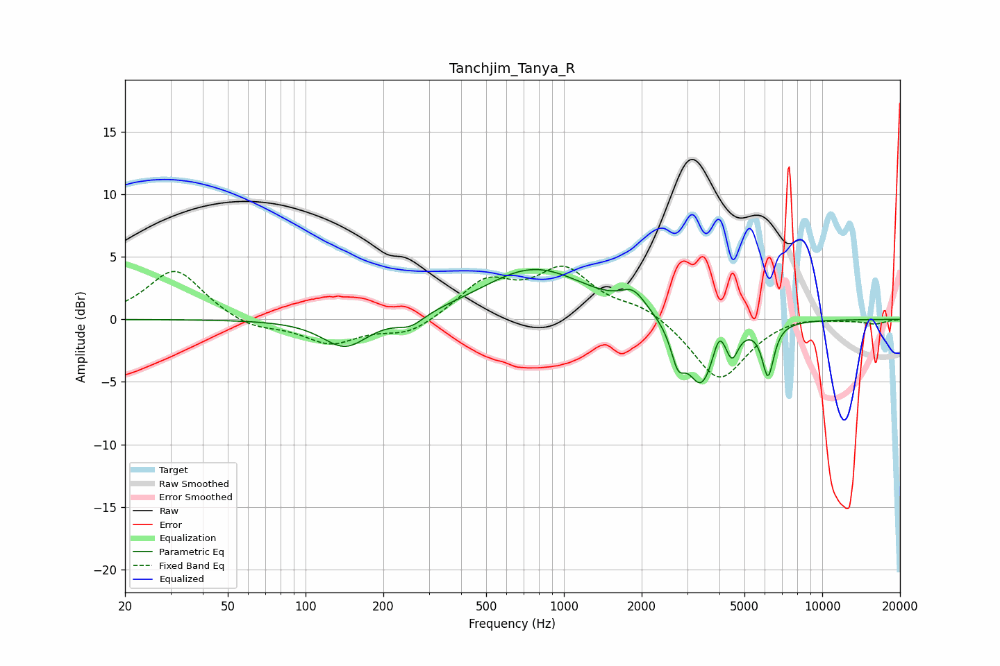

# Tanchjim_Tanya_R
See [usage instructions](https://github.com/jaakkopasanen/AutoEq#usage) for more options and info.

### Parametric EQs
Apply preamp of -4.1 dB when using parametric equalizer.

|   # | Type    |   Fc (Hz) |    Q |   Gain (dB) |
|-----|---------|-----------|------|-------------|
|   1 | Peaking |       142 | 1.59 |        -2.4 |
|   2 | Peaking |       255 | 2.68 |        -0.9 |
|   3 | Peaking |       618 | 0.96 |         0.3 |
|   4 | Peaking |       789 | 0.7  |         3.8 |
|   5 | Peaking |      1859 | 2.9  |         1.5 |
|   6 | Peaking |      2762 | 5.28 |        -2.5 |
|   7 | Peaking |      3407 | 2.53 |        -5.3 |
|   8 | Peaking |      3987 | 5.99 |         1.9 |
|   9 | Peaking |      4479 | 6    |        -2   |
|  10 | Peaking |      6167 | 6    |        -4.2 |

### Fixed Band EQs
When using fixed band (also called graphic) equalizer, apply preamp of **-4.4 dB** (if available) and set gains manually with these parameters.

|   # | Type    |   Fc (Hz) |    Q |   Gain (dB) |
|-----|---------|-----------|------|-------------|
|   1 | Peaking |        31 | 1.41 |         4   |
|   2 | Peaking |        62 | 1.41 |        -0.8 |
|   3 | Peaking |       125 | 1.41 |        -1.9 |
|   4 | Peaking |       250 | 1.41 |        -1.2 |
|   5 | Peaking |       500 | 1.41 |         2.9 |
|   6 | Peaking |      1000 | 1.41 |         3.8 |
|   7 | Peaking |      2000 | 1.41 |         1   |
|   8 | Peaking |      4000 | 1.41 |        -5   |
|   9 | Peaking |      8000 | 1.41 |         0.4 |
|  10 | Peaking |     16000 | 1.41 |        -0.3 |

### Graphs

