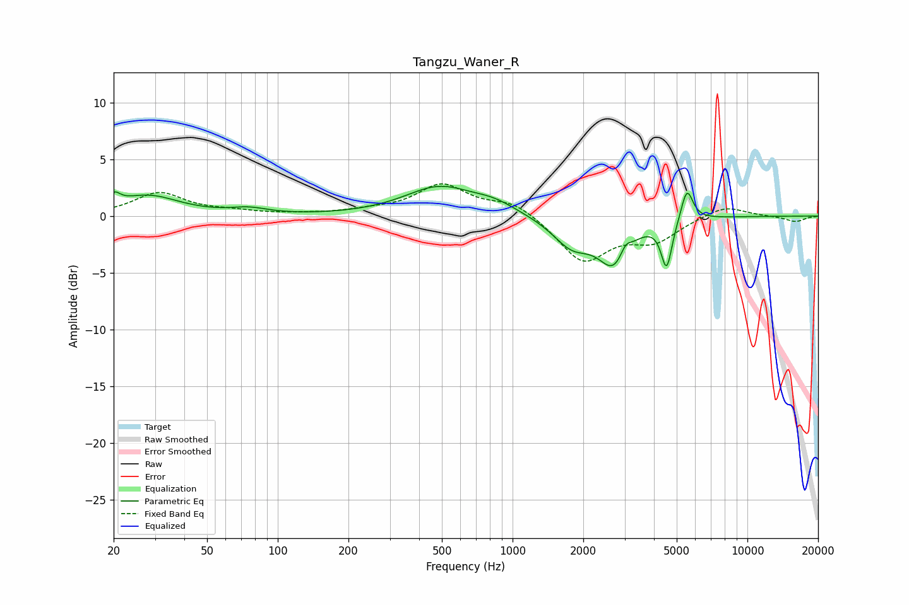

# Tangzu_Waner_R
See [usage instructions](https://github.com/jaakkopasanen/AutoEq#usage) for more options and info.

### Parametric EQs
Apply preamp of -2.7 dB when using parametric equalizer.

|   # | Type    |   Fc (Hz) |    Q |   Gain (dB) |
|-----|---------|-----------|------|-------------|
|   1 | Peaking |        20 | 5.84 |         0.9 |
|   2 | Peaking |        28 | 1.07 |         1.8 |
|   3 | Peaking |        75 | 1.83 |         0.5 |
|   4 | Peaking |       487 | 0.96 |         2.5 |
|   5 | Peaking |       836 | 1.5  |         0.8 |
|   6 | Peaking |      1791 | 1.69 |        -2.5 |
|   7 | Peaking |      2703 | 2.14 |        -3.9 |
|   8 | Peaking |      3025 | 6    |         1   |
|   9 | Peaking |      4528 | 6    |        -4.2 |
|  10 | Peaking |      5528 | 5.52 |         2.9 |

### Fixed Band EQs
When using fixed band (also called graphic) equalizer, apply preamp of **-2.9 dB** (if available) and set gains manually with these parameters.

|   # | Type    |   Fc (Hz) |    Q |   Gain (dB) |
|-----|---------|-----------|------|-------------|
|   1 | Peaking |        31 | 1.41 |         2   |
|   2 | Peaking |        62 | 1.41 |         0.3 |
|   3 | Peaking |       125 | 1.41 |         0.1 |
|   4 | Peaking |       250 | 1.41 |         0.4 |
|   5 | Peaking |       500 | 1.41 |         2.7 |
|   6 | Peaking |      1000 | 1.41 |         1.3 |
|   7 | Peaking |      2000 | 1.41 |        -4   |
|   8 | Peaking |      4000 | 1.41 |        -2   |
|   9 | Peaking |      8000 | 1.41 |         1   |
|  10 | Peaking |     16000 | 1.41 |        -0.5 |

### Graphs

