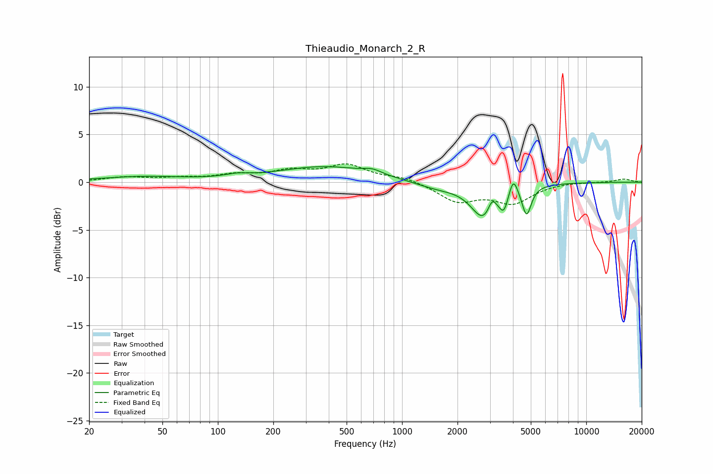

# Thieaudio_Monarch_2_R
See [usage instructions](https://github.com/jaakkopasanen/AutoEq#usage) for more options and info.

### Parametric EQs
Apply preamp of -1.7 dB when using parametric equalizer.

|   # | Type    |   Fc (Hz) |    Q |   Gain (dB) |
|-----|---------|-----------|------|-------------|
|   1 | Peaking |        39 | 0.61 |         0.6 |
|   2 | Peaking |       127 | 2.14 |         0.3 |
|   3 | Peaking |       384 | 0.55 |         1.6 |
|   4 | Peaking |       691 | 2.87 |         0.5 |
|   5 | Peaking |      1534 | 1.2  |        -0.6 |
|   6 | Peaking |      2801 | 2.04 |        -3.8 |
|   7 | Peaking |      3080 | 6    |         1.6 |
|   8 | Peaking |      3575 | 6    |        -1.8 |
|   9 | Peaking |      4014 | 6    |         2   |
|  10 | Peaking |      4744 | 5.69 |        -3   |

### Fixed Band EQs
When using fixed band (also called graphic) equalizer, apply preamp of **-2.0 dB** (if available) and set gains manually with these parameters.

|   # | Type    |   Fc (Hz) |    Q |   Gain (dB) |
|-----|---------|-----------|------|-------------|
|   1 | Peaking |        31 | 1.41 |         0.5 |
|   2 | Peaking |        62 | 1.41 |         0.3 |
|   3 | Peaking |       125 | 1.41 |         0.7 |
|   4 | Peaking |       250 | 1.41 |         1   |
|   5 | Peaking |       500 | 1.41 |         1.7 |
|   6 | Peaking |      1000 | 1.41 |         0.5 |
|   7 | Peaking |      2000 | 1.41 |        -1.9 |
|   8 | Peaking |      4000 | 1.41 |        -2   |
|   9 | Peaking |      8000 | 1.41 |         0.1 |
|  10 | Peaking |     16000 | 1.41 |         0.3 |

### Graphs

