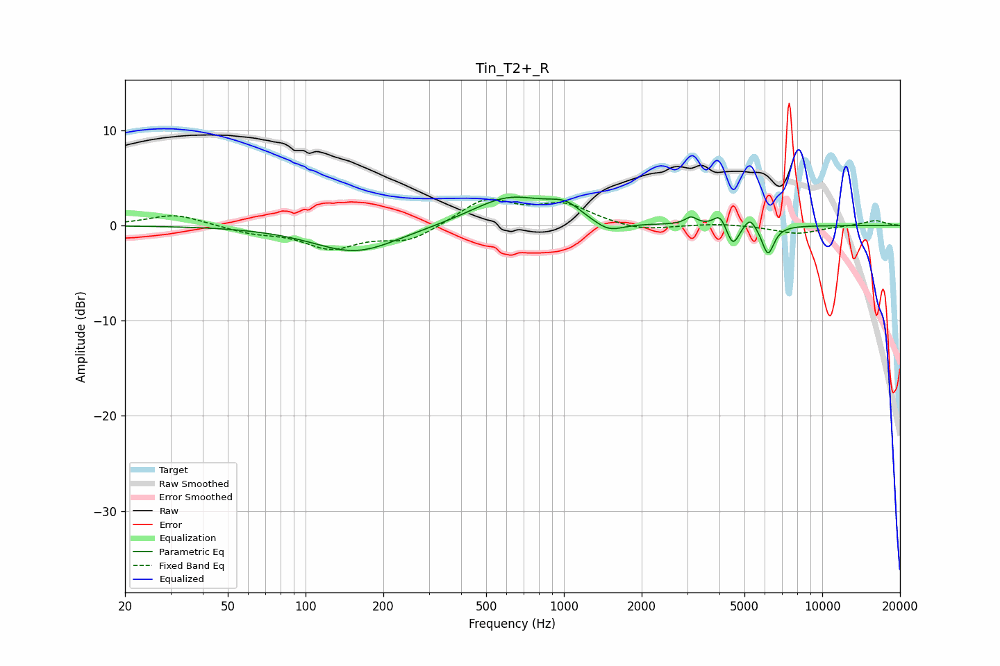

# Tin_T2+_R
See [usage instructions](https://github.com/jaakkopasanen/AutoEq#usage) for more options and info.

### Parametric EQs
Apply preamp of -3.1 dB when using parametric equalizer.

|   # | Type    |   Fc (Hz) |    Q |   Gain (dB) |
|-----|---------|-----------|------|-------------|
|   1 | Peaking |       157 | 0.86 |        -2.8 |
|   2 | Peaking |       614 | 0.97 |         3   |
|   3 | Peaking |       916 | 2.14 |         0.4 |
|   4 | Peaking |      1029 | 2.47 |         1.1 |
|   5 | Peaking |      1490 | 2.43 |        -1.2 |
|   6 | Peaking |      3105 | 6    |         0.8 |
|   7 | Peaking |      4015 | 6    |         1.3 |
|   8 | Peaking |      4509 | 5.93 |        -2.3 |
|   9 | Peaking |      5253 | 6    |         1.2 |
|  10 | Peaking |      6166 | 5.93 |        -3.1 |

### Fixed Band EQs
When using fixed band (also called graphic) equalizer, apply preamp of **-2.9 dB** (if available) and set gains manually with these parameters.

|   # | Type    |   Fc (Hz) |    Q |   Gain (dB) |
|-----|---------|-----------|------|-------------|
|   1 | Peaking |        31 | 1.41 |         1.2 |
|   2 | Peaking |        62 | 1.41 |        -0.7 |
|   3 | Peaking |       125 | 1.41 |        -2.2 |
|   4 | Peaking |       250 | 1.41 |        -1.6 |
|   5 | Peaking |       500 | 1.41 |         2.7 |
|   6 | Peaking |      1000 | 1.41 |         2.1 |
|   7 | Peaking |      2000 | 1.41 |        -0.7 |
|   8 | Peaking |      4000 | 1.41 |         0.2 |
|   9 | Peaking |      8000 | 1.41 |        -0.9 |
|  10 | Peaking |     16000 | 1.41 |         0.5 |

### Graphs

